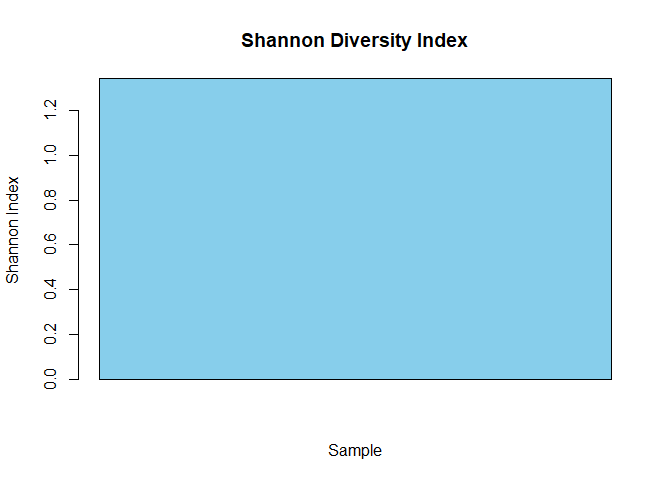

## Install the Neccessay Packages

```r
#install.packages("vegan")

library(vegan)
```

```
## Warning: package 'vegan' was built under R version 4.2.3
```

```
## Loading required package: permute
```

```
## Loading required package: lattice
```

```
## This is vegan 2.6-4
```

```r
library(ggplot2)
```

```
## Warning: package 'ggplot2' was built under R version 4.2.3
```

```r
library(phyloseq)
library(dplyr)
```

```
## Warning: package 'dplyr' was built under R version 4.2.3
```

```
## 
## Attaching package: 'dplyr'
```

```
## The following objects are masked from 'package:stats':
## 
##     filter, lag
```

```
## The following objects are masked from 'package:base':
## 
##     intersect, setdiff, setequal, union
```

```r
library(tidyverse)
```

```
## Warning: package 'tidyverse' was built under R version 4.2.3
```

```
## Warning: package 'tibble' was built under R version 4.2.3
```

```
## Warning: package 'tidyr' was built under R version 4.2.3
```

```
## Warning: package 'readr' was built under R version 4.2.3
```

```
## Warning: package 'purrr' was built under R version 4.2.3
```

```
## Warning: package 'stringr' was built under R version 4.2.3
```

```
## Warning: package 'forcats' was built under R version 4.2.3
```

```
## Warning: package 'lubridate' was built under R version 4.2.3
```

```
## ── Attaching core tidyverse packages ──────────────────────── tidyverse 2.0.0 ──
## ✔ forcats   1.0.0     ✔ stringr   1.5.1
## ✔ lubridate 1.9.2     ✔ tibble    3.2.1
## ✔ purrr     1.0.1     ✔ tidyr     1.3.0
## ✔ readr     2.1.5
```

```
## ── Conflicts ────────────────────────────────────────── tidyverse_conflicts() ──
## ✖ dplyr::filter() masks stats::filter()
## ✖ dplyr::lag()    masks stats::lag()
## ℹ Use the conflicted package (<http://conflicted.r-lib.org/>) to force all conflicts to become errors
```

## Example Data

```r
# Example data (replace with your own data)
data <- matrix(c(10, 5, 3, 2, 1), nrow = 1)

# Calculate Shannon diversity index
shannon_index <- diversity(data, index = "shannon")

# Print the result
print(shannon_index)
```

```
## [1] 1.341895
```
## Example Graph

```r
# Create a bar plot
barplot(shannon_index, main = "Shannon Diversity Index", 
        xlab = "Sample", ylab = "Shannon Index", col = "skyblue")
```

<!-- -->
## Load the SRR606249 metagenomic dataset

```r
# Load the dataset
SRR606249.gtdb.data <- read.csv("C:/Users/brysh/Desktop/2024-sourmash-richness-and-diversity/SRR606249.x.gtdb-rs214.with-lineages.csv")
```


## View the dataset

```r
# View the dataset
head(SRR606249.gtdb.data)
```

```
##   intersect_bp f_orig_query   f_match f_unique_to_query f_unique_weighted
## 1      8980000   0.02121677 0.9760870        0.02121677       0.008180820
## 2      7870000   0.01859421 0.9987310        0.01859421       0.026416980
## 3      6830000   0.01613703 1.0000000        0.01613703       0.085885915
## 4      6300000   0.01488482 1.0000000        0.01488482       0.013561215
## 5      6160000   0.01455405 0.9983793        0.01455405       0.014561939
## 6      5470000   0.01292380 0.9945455        0.01292380       0.008656464
##   average_abund median_abund std_abund
## 1      6.818486            6  4.428523
## 2     25.123253           17 27.388008
## 3     94.117130           92 25.156047
## 4     16.111111           15  6.753743
## 5     17.693182           17 11.807920
## 6     11.844607           10 12.852545
##                                                      filename
## 1 /group/ctbrowngrp/sourmash-db/gtdb-rs214/gtdb-rs214-k31.zip
## 2 /group/ctbrowngrp/sourmash-db/gtdb-rs214/gtdb-rs214-k31.zip
## 3 /group/ctbrowngrp/sourmash-db/gtdb-rs214/gtdb-rs214-k31.zip
## 4 /group/ctbrowngrp/sourmash-db/gtdb-rs214/gtdb-rs214-k31.zip
## 5 /group/ctbrowngrp/sourmash-db/gtdb-rs214/gtdb-rs214-k31.zip
## 6 /group/ctbrowngrp/sourmash-db/gtdb-rs214/gtdb-rs214-k31.zip
##                                                                               name
## 1        GCF_000013645.1 Paraburkholderia xenovorans LB400 strain=LB400, ASM1364v1
## 2        GCF_000009705.1 Nostoc sp. PCC 7120 = FACHB-418 strain=PCC 7120, ASM970v1
## 3                 GCF_000196115.1 Rhodopirellula baltica SH 1 strain=1, ASM19611v1
## 4                     GCA_000018565.1 Herpetosiphon aurantiacus DSM 785, ASM1856v1
## 5 GCF_000011065.1 Bacteroides thetaiotaomicron VPI-5482 strain=VPI-5482, ASM1106v1
## 6                 GCF_000021665.1 Shewanella baltica OS223 strain=OS223, ASM2166v1
##                                md5 f_match_orig unique_intersect_bp
## 1 ee9cb05018009af43429e83e7d502a0a    0.9760870             8980000
## 2 264cfdad44548ad96c4a24b6a514a877    0.9987310             7870000
## 3 7141c3fbf206734950d13cadba0bf46c    1.0000000             6830000
## 4 5165e0f27ae96c8a78da00c2d30a8e36    1.0000000             6300000
## 5 df098e390010d8add7b59e4ff0574d30    0.9983793             6160000
## 6 38729c6374925585db28916b82a6f513    0.9945455             5470000
##   gather_result_rank remaining_bp                          query_filename
## 1                  0    195740000 outputs.paper/trim/SRR606249.trim.fq.gz
## 2                  1    187870000 outputs.paper/trim/SRR606249.trim.fq.gz
## 3                  2    181040000 outputs.paper/trim/SRR606249.trim.fq.gz
## 4                  3    174740000 outputs.paper/trim/SRR606249.trim.fq.gz
## 5                  4    168580000 outputs.paper/trim/SRR606249.trim.fq.gz
## 6                  5    163110000 outputs.paper/trim/SRR606249.trim.fq.gz
##   query_name query_md5  query_bp ksize moltype scaled query_n_hashes
## 1  SRR606249  d3203dba 423250000    31     DNA  10000          42325
## 2  SRR606249  d3203dba 423250000    31     DNA  10000          42325
## 3  SRR606249  d3203dba 423250000    31     DNA  10000          42325
## 4  SRR606249  d3203dba 423250000    31     DNA  10000          42325
## 5  SRR606249  d3203dba 423250000    31     DNA  10000          42325
## 6  SRR606249  d3203dba 423250000    31     DNA  10000          42325
##   query_abundance query_containment_ani match_containment_ani
## 1            True             0.8831245             0.9992195
## 2            True             0.8793737             0.9999590
## 3            True             0.8753623             1.0000000
## 4            True             0.8730844             1.0000000
## 5            True             0.8724517             0.9999477
## 6            True             0.8691147             0.9998236
##   average_containment_ani max_containment_ani potential_false_negative
## 1               0.9411720           0.9992195                    False
## 2               0.9396664           0.9999590                    False
## 3               0.9376812           1.0000000                    False
## 4               0.9365422           1.0000000                    False
## 5               0.9361997           0.9999477                    False
## 6               0.9344692           0.9998236                    False
##   n_unique_weighted_found sum_weighted_found total_weighted_hashes
## 1                    6123               6123                748458
## 2                   19772              25895                748458
## 3                   64282              90177                748458
## 4                   10150             100327                748458
## 5                   10899             111226                748458
## 6                    6479             117705                748458
##                                                                                                                                          lineage
## 1 d__Bacteria;p__Pseudomonadota;c__Gammaproteobacteria;o__Burkholderiales;f__Burkholderiaceae;g__Paraburkholderia;s__Paraburkholderia xenovorans
## 2                    d__Bacteria;p__Cyanobacteriota;c__Cyanobacteriia;o__Cyanobacteriales;f__Nostocaceae;g__Trichormus;s__Trichormus sp000009705
## 3                  d__Bacteria;p__Planctomycetota;c__Planctomycetia;o__Pirellulales;f__Pirellulaceae;g__Rhodopirellula;s__Rhodopirellula baltica
## 4             d__Bacteria;p__Chloroflexota;c__Chloroflexia;o__Chloroflexales;f__Herpetosiphonaceae;g__Herpetosiphon;s__Herpetosiphon aurantiacus
## 5                   d__Bacteria;p__Bacteroidota;c__Bacteroidia;o__Bacteroidales;f__Bacteroidaceae;g__Bacteroides;s__Bacteroides thetaiotaomicron
## 6               d__Bacteria;p__Pseudomonadota;c__Gammaproteobacteria;o__Enterobacterales_A;f__Shewanellaceae;g__Shewanella;s__Shewanella baltica
```

```r
# to get the <- use the shotcut ctrl + alt + -
```

## Seperate the lineage column along the semicolon

```r
# Seperate the lineage column along the semicolon
SRR606249.gtdb.data <- separate(SRR606249.gtdb.data, lineage, c("domain", "phylum", "class", "order", "family", "genus", "species"), sep = ";")

head(SRR606249.gtdb.data)
```

```
##   intersect_bp f_orig_query   f_match f_unique_to_query f_unique_weighted
## 1      8980000   0.02121677 0.9760870        0.02121677       0.008180820
## 2      7870000   0.01859421 0.9987310        0.01859421       0.026416980
## 3      6830000   0.01613703 1.0000000        0.01613703       0.085885915
## 4      6300000   0.01488482 1.0000000        0.01488482       0.013561215
## 5      6160000   0.01455405 0.9983793        0.01455405       0.014561939
## 6      5470000   0.01292380 0.9945455        0.01292380       0.008656464
##   average_abund median_abund std_abund
## 1      6.818486            6  4.428523
## 2     25.123253           17 27.388008
## 3     94.117130           92 25.156047
## 4     16.111111           15  6.753743
## 5     17.693182           17 11.807920
## 6     11.844607           10 12.852545
##                                                      filename
## 1 /group/ctbrowngrp/sourmash-db/gtdb-rs214/gtdb-rs214-k31.zip
## 2 /group/ctbrowngrp/sourmash-db/gtdb-rs214/gtdb-rs214-k31.zip
## 3 /group/ctbrowngrp/sourmash-db/gtdb-rs214/gtdb-rs214-k31.zip
## 4 /group/ctbrowngrp/sourmash-db/gtdb-rs214/gtdb-rs214-k31.zip
## 5 /group/ctbrowngrp/sourmash-db/gtdb-rs214/gtdb-rs214-k31.zip
## 6 /group/ctbrowngrp/sourmash-db/gtdb-rs214/gtdb-rs214-k31.zip
##                                                                               name
## 1        GCF_000013645.1 Paraburkholderia xenovorans LB400 strain=LB400, ASM1364v1
## 2        GCF_000009705.1 Nostoc sp. PCC 7120 = FACHB-418 strain=PCC 7120, ASM970v1
## 3                 GCF_000196115.1 Rhodopirellula baltica SH 1 strain=1, ASM19611v1
## 4                     GCA_000018565.1 Herpetosiphon aurantiacus DSM 785, ASM1856v1
## 5 GCF_000011065.1 Bacteroides thetaiotaomicron VPI-5482 strain=VPI-5482, ASM1106v1
## 6                 GCF_000021665.1 Shewanella baltica OS223 strain=OS223, ASM2166v1
##                                md5 f_match_orig unique_intersect_bp
## 1 ee9cb05018009af43429e83e7d502a0a    0.9760870             8980000
## 2 264cfdad44548ad96c4a24b6a514a877    0.9987310             7870000
## 3 7141c3fbf206734950d13cadba0bf46c    1.0000000             6830000
## 4 5165e0f27ae96c8a78da00c2d30a8e36    1.0000000             6300000
## 5 df098e390010d8add7b59e4ff0574d30    0.9983793             6160000
## 6 38729c6374925585db28916b82a6f513    0.9945455             5470000
##   gather_result_rank remaining_bp                          query_filename
## 1                  0    195740000 outputs.paper/trim/SRR606249.trim.fq.gz
## 2                  1    187870000 outputs.paper/trim/SRR606249.trim.fq.gz
## 3                  2    181040000 outputs.paper/trim/SRR606249.trim.fq.gz
## 4                  3    174740000 outputs.paper/trim/SRR606249.trim.fq.gz
## 5                  4    168580000 outputs.paper/trim/SRR606249.trim.fq.gz
## 6                  5    163110000 outputs.paper/trim/SRR606249.trim.fq.gz
##   query_name query_md5  query_bp ksize moltype scaled query_n_hashes
## 1  SRR606249  d3203dba 423250000    31     DNA  10000          42325
## 2  SRR606249  d3203dba 423250000    31     DNA  10000          42325
## 3  SRR606249  d3203dba 423250000    31     DNA  10000          42325
## 4  SRR606249  d3203dba 423250000    31     DNA  10000          42325
## 5  SRR606249  d3203dba 423250000    31     DNA  10000          42325
## 6  SRR606249  d3203dba 423250000    31     DNA  10000          42325
##   query_abundance query_containment_ani match_containment_ani
## 1            True             0.8831245             0.9992195
## 2            True             0.8793737             0.9999590
## 3            True             0.8753623             1.0000000
## 4            True             0.8730844             1.0000000
## 5            True             0.8724517             0.9999477
## 6            True             0.8691147             0.9998236
##   average_containment_ani max_containment_ani potential_false_negative
## 1               0.9411720           0.9992195                    False
## 2               0.9396664           0.9999590                    False
## 3               0.9376812           1.0000000                    False
## 4               0.9365422           1.0000000                    False
## 5               0.9361997           0.9999477                    False
## 6               0.9344692           0.9998236                    False
##   n_unique_weighted_found sum_weighted_found total_weighted_hashes      domain
## 1                    6123               6123                748458 d__Bacteria
## 2                   19772              25895                748458 d__Bacteria
## 3                   64282              90177                748458 d__Bacteria
## 4                   10150             100327                748458 d__Bacteria
## 5                   10899             111226                748458 d__Bacteria
## 6                    6479             117705                748458 d__Bacteria
##               phylum                  class                 order
## 1  p__Pseudomonadota c__Gammaproteobacteria    o__Burkholderiales
## 2 p__Cyanobacteriota      c__Cyanobacteriia   o__Cyanobacteriales
## 3 p__Planctomycetota      c__Planctomycetia       o__Pirellulales
## 4   p__Chloroflexota        c__Chloroflexia     o__Chloroflexales
## 5    p__Bacteroidota         c__Bacteroidia      o__Bacteroidales
## 6  p__Pseudomonadota c__Gammaproteobacteria o__Enterobacterales_A
##                  family               genus                         species
## 1   f__Burkholderiaceae g__Paraburkholderia  s__Paraburkholderia xenovorans
## 2        f__Nostocaceae       g__Trichormus       s__Trichormus sp000009705
## 3      f__Pirellulaceae   g__Rhodopirellula       s__Rhodopirellula baltica
## 4 f__Herpetosiphonaceae    g__Herpetosiphon    s__Herpetosiphon aurantiacus
## 5     f__Bacteroidaceae      g__Bacteroides s__Bacteroides thetaiotaomicron
## 6     f__Shewanellaceae       g__Shewanella           s__Shewanella baltica
```

## Check the species column for any repeat values

```r
table(SRR606249.gtdb.data$species)
```

```
## 
##            s__Acidobacterium capsulatum              s__Aciduliprofundum boonei 
##                                       1                                       1 
##              s__Akkermansia muciniphila               s__Archaeoglobus fulgidus 
##                                       1                                       1 
##         s__Bacteroides thetaiotaomicron                 s__Bordetella pertussis 
##                                       1                                       1 
##        s__Caldanaerobacter subterraneus          s__Caldicellulosiruptor bescii 
##                                       1                                       1 
## s__Caldicellulosiruptor saccharolyticus                s__Chlorobaculum tepidum 
##                                       1                                       1 
##                  s__Chlorobium limicola          s__Chlorobium phaeobacteroides 
##                                       1                                       1 
##       s__Chlorobium phaeoclathratiforme           s__Chlorobium phaeovibrioides 
##                                       1                                       1 
##             s__Chloroflexus aurantiacus                  s__Cutibacterium acnes 
##                                       1                                       1 
##              s__Deinococcus radiodurans                  s__Desulfovibrio piger 
##                                       1                                       1 
##                s__Dictyoglomus turgidum                s__Enterococcus faecalis 
##                                       1                                       1 
##                     s__Escherichia coli            s__Fusobacterium polymorphum 
##                                       1                                       1 
##              s__Gemmatimonas aurantiaca             s__Geobacter sulfurreducens 
##                                       1                                       1 
##                   s__Haloferax volcanii            s__Herpetosiphon aurantiacus 
##                                       1                                       1 
##     s__Hungateiclostridium thermocellum         s__Hydrogenobaculum sp003543175 
##                                       1                                       1 
##                s__Ignicoccus hospitalis                 s__Leptothrix cholodnii 
##                                       1                                       1 
##               s__Limnothrix sp001693275        s__Methanocaldococcus jannaschii 
##                                       1                                       1 
##            s__Methanococcus maripaludis          s__Methanococcus maripaludis_D 
##                                       1                                       1 
##                s__Methanopyrus kandleri           s__Methanosarcina acetivorans 
##                                       1                                       1 
##           s__Microbacterium sp000411455             s__Micromonospora arenicola 
##                                       1                                       4 
##               s__Micromonospora tropica                s__Nanoarchaeum equitans 
##                                       1                                       1 
##        s__Nitratidesulfovibrio vulgaris                s__Nitrosomonas europaea 
##                                       2                                       1 
##          s__Paraburkholderia xenovorans                 s__Persephonella marina 
##                                       1                                       1 
##                 s__Phocaeicola vulgatus             s__Porphyromonas gingivalis 
##                                       1                                       1 
##          s__Proteiniclasticum ruminis_A        s__Proteiniclasticum sp003514505 
##                                       1                                       1 
##               s__Pyrobaculum aerophilum              s__Pyrobaculum arsenaticum 
##                                       1                                       1 
##             s__Pyrobaculum calidifontis                  s__Pyrococcus furiosus 
##                                       1                                       1 
##                s__Pyrococcus horikoshii               s__Rhodopirellula baltica 
##                                       1                                       2 
##                  s__Ruegeria_B pomeroyi                   s__Shewanella baltica 
##                                       1                                       2 
##               s__Sphingomonas aquatilis       s__Stenotrophomonas maltophilia_S 
##                                       1                                       1 
##        s__Streptococcus parasanguinis_B        s__Streptococcus parasanguinis_E 
##                                       1                                       1 
##        s__Streptococcus parasanguinis_M             s__Streptococcus salivarius 
##                                       1                                       1 
##            s__Streptococcus sp900766505              s__Sulfitobacter pontiacus 
##                                       1                                       3 
##     s__Sulfurihydrogenibium sp003510745  s__Sulfurihydrogenibium yellowstonense 
##                                       1                                       1 
##              s__Sulfurisphaera tokodaii  s__Thermoanaerobacter pseudethanolicus 
##                                       1                                       1 
##                  s__Thermotoga maritima               s__Thermotoga neapolitana 
##                                       1                                       1 
##                s__Thermotoga petrophila                 s__Thermus thermophilus 
##                                       1                                       1 
##                s__Treponema_B denticola               s__Trichormus sp000009705 
##                                       1                                       1 
##                 s__UBA11096 sp003534055               s__Wolinella succinogenes 
##                                       1                                       1 
##                    s__Zymomonas mobilis 
##                                       1
```


## Add a new column to the dataset call microbe this is a standin for the normal OTU column

```r
# Number of rows in the dataset
num_rows <- nrow(SRR606249.gtdb.data)

# Add a new column
SRR606249.gtdb.data$microbe <- paste("microbe_" , 1:num_rows)


head(SRR606249.gtdb.data)
```

```
##   intersect_bp f_orig_query   f_match f_unique_to_query f_unique_weighted
## 1      8980000   0.02121677 0.9760870        0.02121677       0.008180820
## 2      7870000   0.01859421 0.9987310        0.01859421       0.026416980
## 3      6830000   0.01613703 1.0000000        0.01613703       0.085885915
## 4      6300000   0.01488482 1.0000000        0.01488482       0.013561215
## 5      6160000   0.01455405 0.9983793        0.01455405       0.014561939
## 6      5470000   0.01292380 0.9945455        0.01292380       0.008656464
##   average_abund median_abund std_abund
## 1      6.818486            6  4.428523
## 2     25.123253           17 27.388008
## 3     94.117130           92 25.156047
## 4     16.111111           15  6.753743
## 5     17.693182           17 11.807920
## 6     11.844607           10 12.852545
##                                                      filename
## 1 /group/ctbrowngrp/sourmash-db/gtdb-rs214/gtdb-rs214-k31.zip
## 2 /group/ctbrowngrp/sourmash-db/gtdb-rs214/gtdb-rs214-k31.zip
## 3 /group/ctbrowngrp/sourmash-db/gtdb-rs214/gtdb-rs214-k31.zip
## 4 /group/ctbrowngrp/sourmash-db/gtdb-rs214/gtdb-rs214-k31.zip
## 5 /group/ctbrowngrp/sourmash-db/gtdb-rs214/gtdb-rs214-k31.zip
## 6 /group/ctbrowngrp/sourmash-db/gtdb-rs214/gtdb-rs214-k31.zip
##                                                                               name
## 1        GCF_000013645.1 Paraburkholderia xenovorans LB400 strain=LB400, ASM1364v1
## 2        GCF_000009705.1 Nostoc sp. PCC 7120 = FACHB-418 strain=PCC 7120, ASM970v1
## 3                 GCF_000196115.1 Rhodopirellula baltica SH 1 strain=1, ASM19611v1
## 4                     GCA_000018565.1 Herpetosiphon aurantiacus DSM 785, ASM1856v1
## 5 GCF_000011065.1 Bacteroides thetaiotaomicron VPI-5482 strain=VPI-5482, ASM1106v1
## 6                 GCF_000021665.1 Shewanella baltica OS223 strain=OS223, ASM2166v1
##                                md5 f_match_orig unique_intersect_bp
## 1 ee9cb05018009af43429e83e7d502a0a    0.9760870             8980000
## 2 264cfdad44548ad96c4a24b6a514a877    0.9987310             7870000
## 3 7141c3fbf206734950d13cadba0bf46c    1.0000000             6830000
## 4 5165e0f27ae96c8a78da00c2d30a8e36    1.0000000             6300000
## 5 df098e390010d8add7b59e4ff0574d30    0.9983793             6160000
## 6 38729c6374925585db28916b82a6f513    0.9945455             5470000
##   gather_result_rank remaining_bp                          query_filename
## 1                  0    195740000 outputs.paper/trim/SRR606249.trim.fq.gz
## 2                  1    187870000 outputs.paper/trim/SRR606249.trim.fq.gz
## 3                  2    181040000 outputs.paper/trim/SRR606249.trim.fq.gz
## 4                  3    174740000 outputs.paper/trim/SRR606249.trim.fq.gz
## 5                  4    168580000 outputs.paper/trim/SRR606249.trim.fq.gz
## 6                  5    163110000 outputs.paper/trim/SRR606249.trim.fq.gz
##   query_name query_md5  query_bp ksize moltype scaled query_n_hashes
## 1  SRR606249  d3203dba 423250000    31     DNA  10000          42325
## 2  SRR606249  d3203dba 423250000    31     DNA  10000          42325
## 3  SRR606249  d3203dba 423250000    31     DNA  10000          42325
## 4  SRR606249  d3203dba 423250000    31     DNA  10000          42325
## 5  SRR606249  d3203dba 423250000    31     DNA  10000          42325
## 6  SRR606249  d3203dba 423250000    31     DNA  10000          42325
##   query_abundance query_containment_ani match_containment_ani
## 1            True             0.8831245             0.9992195
## 2            True             0.8793737             0.9999590
## 3            True             0.8753623             1.0000000
## 4            True             0.8730844             1.0000000
## 5            True             0.8724517             0.9999477
## 6            True             0.8691147             0.9998236
##   average_containment_ani max_containment_ani potential_false_negative
## 1               0.9411720           0.9992195                    False
## 2               0.9396664           0.9999590                    False
## 3               0.9376812           1.0000000                    False
## 4               0.9365422           1.0000000                    False
## 5               0.9361997           0.9999477                    False
## 6               0.9344692           0.9998236                    False
##   n_unique_weighted_found sum_weighted_found total_weighted_hashes      domain
## 1                    6123               6123                748458 d__Bacteria
## 2                   19772              25895                748458 d__Bacteria
## 3                   64282              90177                748458 d__Bacteria
## 4                   10150             100327                748458 d__Bacteria
## 5                   10899             111226                748458 d__Bacteria
## 6                    6479             117705                748458 d__Bacteria
##               phylum                  class                 order
## 1  p__Pseudomonadota c__Gammaproteobacteria    o__Burkholderiales
## 2 p__Cyanobacteriota      c__Cyanobacteriia   o__Cyanobacteriales
## 3 p__Planctomycetota      c__Planctomycetia       o__Pirellulales
## 4   p__Chloroflexota        c__Chloroflexia     o__Chloroflexales
## 5    p__Bacteroidota         c__Bacteroidia      o__Bacteroidales
## 6  p__Pseudomonadota c__Gammaproteobacteria o__Enterobacterales_A
##                  family               genus                         species
## 1   f__Burkholderiaceae g__Paraburkholderia  s__Paraburkholderia xenovorans
## 2        f__Nostocaceae       g__Trichormus       s__Trichormus sp000009705
## 3      f__Pirellulaceae   g__Rhodopirellula       s__Rhodopirellula baltica
## 4 f__Herpetosiphonaceae    g__Herpetosiphon    s__Herpetosiphon aurantiacus
## 5     f__Bacteroidaceae      g__Bacteroides s__Bacteroides thetaiotaomicron
## 6     f__Shewanellaceae       g__Shewanella           s__Shewanella baltica
##      microbe
## 1 microbe_ 1
## 2 microbe_ 2
## 3 microbe_ 3
## 4 microbe_ 4
## 5 microbe_ 5
## 6 microbe_ 6
```

# Remove all column except `f_unique_weighted` and microbe

```r
# Remove all columns except `f_unique_weighted` and microbe
otu_SRR60 <- SRR606249.gtdb.data %>%
  select(f_unique_weighted, microbe, species)

head(otu_SRR60)
```

```
##   f_unique_weighted    microbe                         species
## 1       0.008180820 microbe_ 1  s__Paraburkholderia xenovorans
## 2       0.026416980 microbe_ 2       s__Trichormus sp000009705
## 3       0.085885915 microbe_ 3       s__Rhodopirellula baltica
## 4       0.013561215 microbe_ 4    s__Herpetosiphon aurantiacus
## 5       0.014561939 microbe_ 5 s__Bacteroides thetaiotaomicron
## 6       0.008656464 microbe_ 6           s__Shewanella baltica
```

## Aggregate the dataset by species

```r
otu_SRR60_agg <- aggregate(f_unique_weighted ~ species, data = otu_SRR60, FUN = sum)


head(otu_SRR60_agg)
```

```
##                           species f_unique_weighted
## 1    s__Acidobacterium capsulatum       0.031484733
## 2      s__Aciduliprofundum boonei       0.010418754
## 3      s__Akkermansia muciniphila       0.009059961
## 4       s__Archaeoglobus fulgidus       0.023975961
## 5 s__Bacteroides thetaiotaomicron       0.014561939
## 6         s__Bordetella pertussis       0.007885546
```


## Check the species column for any repeat values

```r
table(otu_SRR60_agg$species)
```

```
## 
##            s__Acidobacterium capsulatum              s__Aciduliprofundum boonei 
##                                       1                                       1 
##              s__Akkermansia muciniphila               s__Archaeoglobus fulgidus 
##                                       1                                       1 
##         s__Bacteroides thetaiotaomicron                 s__Bordetella pertussis 
##                                       1                                       1 
##        s__Caldanaerobacter subterraneus          s__Caldicellulosiruptor bescii 
##                                       1                                       1 
## s__Caldicellulosiruptor saccharolyticus                s__Chlorobaculum tepidum 
##                                       1                                       1 
##                  s__Chlorobium limicola          s__Chlorobium phaeobacteroides 
##                                       1                                       1 
##       s__Chlorobium phaeoclathratiforme           s__Chlorobium phaeovibrioides 
##                                       1                                       1 
##             s__Chloroflexus aurantiacus                  s__Cutibacterium acnes 
##                                       1                                       1 
##              s__Deinococcus radiodurans                  s__Desulfovibrio piger 
##                                       1                                       1 
##                s__Dictyoglomus turgidum                s__Enterococcus faecalis 
##                                       1                                       1 
##                     s__Escherichia coli            s__Fusobacterium polymorphum 
##                                       1                                       1 
##              s__Gemmatimonas aurantiaca             s__Geobacter sulfurreducens 
##                                       1                                       1 
##                   s__Haloferax volcanii            s__Herpetosiphon aurantiacus 
##                                       1                                       1 
##     s__Hungateiclostridium thermocellum         s__Hydrogenobaculum sp003543175 
##                                       1                                       1 
##                s__Ignicoccus hospitalis                 s__Leptothrix cholodnii 
##                                       1                                       1 
##               s__Limnothrix sp001693275        s__Methanocaldococcus jannaschii 
##                                       1                                       1 
##            s__Methanococcus maripaludis          s__Methanococcus maripaludis_D 
##                                       1                                       1 
##                s__Methanopyrus kandleri           s__Methanosarcina acetivorans 
##                                       1                                       1 
##           s__Microbacterium sp000411455             s__Micromonospora arenicola 
##                                       1                                       1 
##               s__Micromonospora tropica                s__Nanoarchaeum equitans 
##                                       1                                       1 
##        s__Nitratidesulfovibrio vulgaris                s__Nitrosomonas europaea 
##                                       1                                       1 
##          s__Paraburkholderia xenovorans                 s__Persephonella marina 
##                                       1                                       1 
##                 s__Phocaeicola vulgatus             s__Porphyromonas gingivalis 
##                                       1                                       1 
##          s__Proteiniclasticum ruminis_A        s__Proteiniclasticum sp003514505 
##                                       1                                       1 
##               s__Pyrobaculum aerophilum              s__Pyrobaculum arsenaticum 
##                                       1                                       1 
##             s__Pyrobaculum calidifontis                  s__Pyrococcus furiosus 
##                                       1                                       1 
##                s__Pyrococcus horikoshii               s__Rhodopirellula baltica 
##                                       1                                       1 
##                  s__Ruegeria_B pomeroyi                   s__Shewanella baltica 
##                                       1                                       1 
##               s__Sphingomonas aquatilis       s__Stenotrophomonas maltophilia_S 
##                                       1                                       1 
##        s__Streptococcus parasanguinis_B        s__Streptococcus parasanguinis_E 
##                                       1                                       1 
##        s__Streptococcus parasanguinis_M             s__Streptococcus salivarius 
##                                       1                                       1 
##            s__Streptococcus sp900766505              s__Sulfitobacter pontiacus 
##                                       1                                       1 
##     s__Sulfurihydrogenibium sp003510745  s__Sulfurihydrogenibium yellowstonense 
##                                       1                                       1 
##              s__Sulfurisphaera tokodaii  s__Thermoanaerobacter pseudethanolicus 
##                                       1                                       1 
##                  s__Thermotoga maritima               s__Thermotoga neapolitana 
##                                       1                                       1 
##                s__Thermotoga petrophila                 s__Thermus thermophilus 
##                                       1                                       1 
##                s__Treponema_B denticola               s__Trichormus sp000009705 
##                                       1                                       1 
##                 s__UBA11096 sp003534055               s__Wolinella succinogenes 
##                                       1                                       1 
##                    s__Zymomonas mobilis 
##                                       1
```

## Add a new column to the dataset call microbe this is a standin for the normal OTU column . . . again

```r
# Number of rows in the dataset
num_rows <- nrow(otu_SRR60_agg)

# Add a new column
otu_SRR60_agg$microbe <- paste("microbe_" , 1:num_rows)


head(otu_SRR60_agg)
```

```
##                           species f_unique_weighted    microbe
## 1    s__Acidobacterium capsulatum       0.031484733 microbe_ 1
## 2      s__Aciduliprofundum boonei       0.010418754 microbe_ 2
## 3      s__Akkermansia muciniphila       0.009059961 microbe_ 3
## 4       s__Archaeoglobus fulgidus       0.023975961 microbe_ 4
## 5 s__Bacteroides thetaiotaomicron       0.014561939 microbe_ 5
## 6         s__Bordetella pertussis       0.007885546 microbe_ 6
```

## Make all rownames microbe and remove the microbe column . . . again

```r
# Make all rownames SRR606249
rownames(otu_SRR60_agg) <- otu_SRR60_agg$microbe


# Remove the microbe and species column
otu_SRR60_agg <- otu_SRR60_agg %>%
  select(-microbe) %>%
  select(-species)

head(otu_SRR60_agg)
```

```
##            f_unique_weighted
## microbe_ 1       0.031484733
## microbe_ 2       0.010418754
## microbe_ 3       0.009059961
## microbe_ 4       0.023975961
## microbe_ 5       0.014561939
## microbe_ 6       0.007885546
```


## Transpose

```r
# Transpose the dataset
otu_SRR60 <- t(otu_SRR60_agg)

head(otu_SRR60)
```

```
##                   microbe_ 1 microbe_ 2  microbe_ 3 microbe_ 4 microbe_ 5
## f_unique_weighted 0.03148473 0.01041875 0.009059961 0.02397596 0.01456194
##                    microbe_ 6   microbe_ 7 microbe_ 8 microbe_ 9 microbe_ 10
## f_unique_weighted 0.007885546 1.068864e-05 0.01388187 0.01122174  0.01055771
##                   microbe_ 11 microbe_ 12 microbe_ 13 microbe_ 14 microbe_ 15
## f_unique_weighted  0.01375896  0.01313768  0.01055637  0.01416646  0.01766699
##                    microbe_ 16 microbe_ 17 microbe_ 18 microbe_ 19 microbe_ 20
## f_unique_weighted 1.603296e-05 0.005993656  0.01173747 0.009393981 0.009092027
##                   microbe_ 21 microbe_ 22 microbe_ 23 microbe_ 24 microbe_ 25
## f_unique_weighted 0.007713192  0.00408707  0.03697068   0.0256474 0.009511556
##                   microbe_ 26 microbe_ 27 microbe_ 28 microbe_ 29 microbe_ 30
## f_unique_weighted  0.01356122  0.01338084  0.01325525 0.002859212  0.01226255
##                    microbe_ 31 microbe_ 32 microbe_ 33 microbe_ 34 microbe_ 35
## f_unique_weighted 4.409065e-05 0.009401997 0.005973615 0.008108671  0.01040673
##                   microbe_ 36 microbe_ 37 microbe_ 38 microbe_ 39 microbe_ 40
## f_unique_weighted 0.009666541 1.33608e-05 0.009058625 0.009921732  0.01159317
##                   microbe_ 41 microbe_ 42 microbe_ 43 microbe_ 44 microbe_ 45
## f_unique_weighted 0.008994493  0.02776509  0.00818082   0.0124496 0.009313816
##                   microbe_ 46 microbe_ 47 microbe_ 48 microbe_ 49 microbe_ 50
## f_unique_weighted 0.007396541 0.000448923 0.008807441  0.01734232   0.0105243
##                   microbe_ 51 microbe_ 52 microbe_ 53 microbe_ 54 microbe_ 55
## f_unique_weighted  0.01362134  0.01475834  0.02068119  0.08589794 0.006204757
##                   microbe_ 56  microbe_ 57 microbe_ 58 microbe_ 59  microbe_ 60
## f_unique_weighted  0.01125113 6.680402e-06 1.33608e-05 1.33608e-05 0.0001402884
##                    microbe_ 61  microbe_ 62  microbe_ 63 microbe_ 64
## f_unique_weighted 1.603296e-05 2.538553e-05 4.943497e-05  0.05825444
##                   microbe_ 65 microbe_ 66 microbe_ 67 microbe_ 68 microbe_ 69
## f_unique_weighted 0.006080502 0.005447199  0.02626333 0.005730448   0.0144123
##                   microbe_ 70 microbe_ 71 microbe_ 72 microbe_ 73 microbe_ 74
## f_unique_weighted  0.02792675  0.03420766  0.01087837  0.01741313  0.02641698
##                    microbe_ 75 microbe_ 76 microbe_ 77
## f_unique_weighted 8.016482e-06 0.008677842  0.00232478
```

## Summary of the transposed dataset

```r
summary(otu_SRR60)
```

```
##    microbe_ 1        microbe_ 2        microbe_ 3        microbe_ 4     
##  Min.   :0.03148   Min.   :0.01042   Min.   :0.00906   Min.   :0.02398  
##  1st Qu.:0.03148   1st Qu.:0.01042   1st Qu.:0.00906   1st Qu.:0.02398  
##  Median :0.03148   Median :0.01042   Median :0.00906   Median :0.02398  
##  Mean   :0.03148   Mean   :0.01042   Mean   :0.00906   Mean   :0.02398  
##  3rd Qu.:0.03148   3rd Qu.:0.01042   3rd Qu.:0.00906   3rd Qu.:0.02398  
##  Max.   :0.03148   Max.   :0.01042   Max.   :0.00906   Max.   :0.02398  
##    microbe_ 5        microbe_ 6         microbe_ 7          microbe_ 8     
##  Min.   :0.01456   Min.   :0.007886   Min.   :1.069e-05   Min.   :0.01388  
##  1st Qu.:0.01456   1st Qu.:0.007886   1st Qu.:1.069e-05   1st Qu.:0.01388  
##  Median :0.01456   Median :0.007886   Median :1.069e-05   Median :0.01388  
##  Mean   :0.01456   Mean   :0.007886   Mean   :1.069e-05   Mean   :0.01388  
##  3rd Qu.:0.01456   3rd Qu.:0.007886   3rd Qu.:1.069e-05   3rd Qu.:0.01388  
##  Max.   :0.01456   Max.   :0.007886   Max.   :1.069e-05   Max.   :0.01388  
##    microbe_ 9       microbe_ 10       microbe_ 11       microbe_ 12     
##  Min.   :0.01122   Min.   :0.01056   Min.   :0.01376   Min.   :0.01314  
##  1st Qu.:0.01122   1st Qu.:0.01056   1st Qu.:0.01376   1st Qu.:0.01314  
##  Median :0.01122   Median :0.01056   Median :0.01376   Median :0.01314  
##  Mean   :0.01122   Mean   :0.01056   Mean   :0.01376   Mean   :0.01314  
##  3rd Qu.:0.01122   3rd Qu.:0.01056   3rd Qu.:0.01376   3rd Qu.:0.01314  
##  Max.   :0.01122   Max.   :0.01056   Max.   :0.01376   Max.   :0.01314  
##   microbe_ 13       microbe_ 14       microbe_ 15       microbe_ 16       
##  Min.   :0.01056   Min.   :0.01417   Min.   :0.01767   Min.   :1.603e-05  
##  1st Qu.:0.01056   1st Qu.:0.01417   1st Qu.:0.01767   1st Qu.:1.603e-05  
##  Median :0.01056   Median :0.01417   Median :0.01767   Median :1.603e-05  
##  Mean   :0.01056   Mean   :0.01417   Mean   :0.01767   Mean   :1.603e-05  
##  3rd Qu.:0.01056   3rd Qu.:0.01417   3rd Qu.:0.01767   3rd Qu.:1.603e-05  
##  Max.   :0.01056   Max.   :0.01417   Max.   :0.01767   Max.   :1.603e-05  
##   microbe_ 17        microbe_ 18       microbe_ 19        microbe_ 20      
##  Min.   :0.005994   Min.   :0.01174   Min.   :0.009394   Min.   :0.009092  
##  1st Qu.:0.005994   1st Qu.:0.01174   1st Qu.:0.009394   1st Qu.:0.009092  
##  Median :0.005994   Median :0.01174   Median :0.009394   Median :0.009092  
##  Mean   :0.005994   Mean   :0.01174   Mean   :0.009394   Mean   :0.009092  
##  3rd Qu.:0.005994   3rd Qu.:0.01174   3rd Qu.:0.009394   3rd Qu.:0.009092  
##  Max.   :0.005994   Max.   :0.01174   Max.   :0.009394   Max.   :0.009092  
##   microbe_ 21        microbe_ 22        microbe_ 23       microbe_ 24     
##  Min.   :0.007713   Min.   :0.004087   Min.   :0.03697   Min.   :0.02565  
##  1st Qu.:0.007713   1st Qu.:0.004087   1st Qu.:0.03697   1st Qu.:0.02565  
##  Median :0.007713   Median :0.004087   Median :0.03697   Median :0.02565  
##  Mean   :0.007713   Mean   :0.004087   Mean   :0.03697   Mean   :0.02565  
##  3rd Qu.:0.007713   3rd Qu.:0.004087   3rd Qu.:0.03697   3rd Qu.:0.02565  
##  Max.   :0.007713   Max.   :0.004087   Max.   :0.03697   Max.   :0.02565  
##   microbe_ 25        microbe_ 26       microbe_ 27       microbe_ 28     
##  Min.   :0.009512   Min.   :0.01356   Min.   :0.01338   Min.   :0.01326  
##  1st Qu.:0.009512   1st Qu.:0.01356   1st Qu.:0.01338   1st Qu.:0.01326  
##  Median :0.009512   Median :0.01356   Median :0.01338   Median :0.01326  
##  Mean   :0.009512   Mean   :0.01356   Mean   :0.01338   Mean   :0.01326  
##  3rd Qu.:0.009512   3rd Qu.:0.01356   3rd Qu.:0.01338   3rd Qu.:0.01326  
##  Max.   :0.009512   Max.   :0.01356   Max.   :0.01338   Max.   :0.01326  
##   microbe_ 29        microbe_ 30       microbe_ 31         microbe_ 32      
##  Min.   :0.002859   Min.   :0.01226   Min.   :4.409e-05   Min.   :0.009402  
##  1st Qu.:0.002859   1st Qu.:0.01226   1st Qu.:4.409e-05   1st Qu.:0.009402  
##  Median :0.002859   Median :0.01226   Median :4.409e-05   Median :0.009402  
##  Mean   :0.002859   Mean   :0.01226   Mean   :4.409e-05   Mean   :0.009402  
##  3rd Qu.:0.002859   3rd Qu.:0.01226   3rd Qu.:4.409e-05   3rd Qu.:0.009402  
##  Max.   :0.002859   Max.   :0.01226   Max.   :4.409e-05   Max.   :0.009402  
##   microbe_ 33        microbe_ 34        microbe_ 35       microbe_ 36      
##  Min.   :0.005974   Min.   :0.008109   Min.   :0.01041   Min.   :0.009667  
##  1st Qu.:0.005974   1st Qu.:0.008109   1st Qu.:0.01041   1st Qu.:0.009667  
##  Median :0.005974   Median :0.008109   Median :0.01041   Median :0.009667  
##  Mean   :0.005974   Mean   :0.008109   Mean   :0.01041   Mean   :0.009667  
##  3rd Qu.:0.005974   3rd Qu.:0.008109   3rd Qu.:0.01041   3rd Qu.:0.009667  
##  Max.   :0.005974   Max.   :0.008109   Max.   :0.01041   Max.   :0.009667  
##   microbe_ 37         microbe_ 38        microbe_ 39        microbe_ 40     
##  Min.   :1.336e-05   Min.   :0.009059   Min.   :0.009922   Min.   :0.01159  
##  1st Qu.:1.336e-05   1st Qu.:0.009059   1st Qu.:0.009922   1st Qu.:0.01159  
##  Median :1.336e-05   Median :0.009059   Median :0.009922   Median :0.01159  
##  Mean   :1.336e-05   Mean   :0.009059   Mean   :0.009922   Mean   :0.01159  
##  3rd Qu.:1.336e-05   3rd Qu.:0.009059   3rd Qu.:0.009922   3rd Qu.:0.01159  
##  Max.   :1.336e-05   Max.   :0.009059   Max.   :0.009922   Max.   :0.01159  
##   microbe_ 41        microbe_ 42       microbe_ 43        microbe_ 44     
##  Min.   :0.008994   Min.   :0.02777   Min.   :0.008181   Min.   :0.01245  
##  1st Qu.:0.008994   1st Qu.:0.02777   1st Qu.:0.008181   1st Qu.:0.01245  
##  Median :0.008994   Median :0.02777   Median :0.008181   Median :0.01245  
##  Mean   :0.008994   Mean   :0.02777   Mean   :0.008181   Mean   :0.01245  
##  3rd Qu.:0.008994   3rd Qu.:0.02777   3rd Qu.:0.008181   3rd Qu.:0.01245  
##  Max.   :0.008994   Max.   :0.02777   Max.   :0.008181   Max.   :0.01245  
##   microbe_ 45        microbe_ 46        microbe_ 47         microbe_ 48      
##  Min.   :0.009314   Min.   :0.007397   Min.   :0.0004489   Min.   :0.008807  
##  1st Qu.:0.009314   1st Qu.:0.007397   1st Qu.:0.0004489   1st Qu.:0.008807  
##  Median :0.009314   Median :0.007397   Median :0.0004489   Median :0.008807  
##  Mean   :0.009314   Mean   :0.007397   Mean   :0.0004489   Mean   :0.008807  
##  3rd Qu.:0.009314   3rd Qu.:0.007397   3rd Qu.:0.0004489   3rd Qu.:0.008807  
##  Max.   :0.009314   Max.   :0.007397   Max.   :0.0004489   Max.   :0.008807  
##   microbe_ 49       microbe_ 50       microbe_ 51       microbe_ 52     
##  Min.   :0.01734   Min.   :0.01052   Min.   :0.01362   Min.   :0.01476  
##  1st Qu.:0.01734   1st Qu.:0.01052   1st Qu.:0.01362   1st Qu.:0.01476  
##  Median :0.01734   Median :0.01052   Median :0.01362   Median :0.01476  
##  Mean   :0.01734   Mean   :0.01052   Mean   :0.01362   Mean   :0.01476  
##  3rd Qu.:0.01734   3rd Qu.:0.01052   3rd Qu.:0.01362   3rd Qu.:0.01476  
##  Max.   :0.01734   Max.   :0.01052   Max.   :0.01362   Max.   :0.01476  
##   microbe_ 53       microbe_ 54      microbe_ 55        microbe_ 56     
##  Min.   :0.02068   Min.   :0.0859   Min.   :0.006205   Min.   :0.01125  
##  1st Qu.:0.02068   1st Qu.:0.0859   1st Qu.:0.006205   1st Qu.:0.01125  
##  Median :0.02068   Median :0.0859   Median :0.006205   Median :0.01125  
##  Mean   :0.02068   Mean   :0.0859   Mean   :0.006205   Mean   :0.01125  
##  3rd Qu.:0.02068   3rd Qu.:0.0859   3rd Qu.:0.006205   3rd Qu.:0.01125  
##  Max.   :0.02068   Max.   :0.0859   Max.   :0.006205   Max.   :0.01125  
##   microbe_ 57        microbe_ 58         microbe_ 59         microbe_ 60       
##  Min.   :6.68e-06   Min.   :1.336e-05   Min.   :1.336e-05   Min.   :0.0001403  
##  1st Qu.:6.68e-06   1st Qu.:1.336e-05   1st Qu.:1.336e-05   1st Qu.:0.0001403  
##  Median :6.68e-06   Median :1.336e-05   Median :1.336e-05   Median :0.0001403  
##  Mean   :6.68e-06   Mean   :1.336e-05   Mean   :1.336e-05   Mean   :0.0001403  
##  3rd Qu.:6.68e-06   3rd Qu.:1.336e-05   3rd Qu.:1.336e-05   3rd Qu.:0.0001403  
##  Max.   :6.68e-06   Max.   :1.336e-05   Max.   :1.336e-05   Max.   :0.0001403  
##   microbe_ 61         microbe_ 62         microbe_ 63         microbe_ 64     
##  Min.   :1.603e-05   Min.   :2.539e-05   Min.   :4.943e-05   Min.   :0.05825  
##  1st Qu.:1.603e-05   1st Qu.:2.539e-05   1st Qu.:4.943e-05   1st Qu.:0.05825  
##  Median :1.603e-05   Median :2.539e-05   Median :4.943e-05   Median :0.05825  
##  Mean   :1.603e-05   Mean   :2.539e-05   Mean   :4.943e-05   Mean   :0.05825  
##  3rd Qu.:1.603e-05   3rd Qu.:2.539e-05   3rd Qu.:4.943e-05   3rd Qu.:0.05825  
##  Max.   :1.603e-05   Max.   :2.539e-05   Max.   :4.943e-05   Max.   :0.05825  
##   microbe_ 65        microbe_ 66        microbe_ 67       microbe_ 68     
##  Min.   :0.006081   Min.   :0.005447   Min.   :0.02626   Min.   :0.00573  
##  1st Qu.:0.006081   1st Qu.:0.005447   1st Qu.:0.02626   1st Qu.:0.00573  
##  Median :0.006081   Median :0.005447   Median :0.02626   Median :0.00573  
##  Mean   :0.006081   Mean   :0.005447   Mean   :0.02626   Mean   :0.00573  
##  3rd Qu.:0.006081   3rd Qu.:0.005447   3rd Qu.:0.02626   3rd Qu.:0.00573  
##  Max.   :0.006081   Max.   :0.005447   Max.   :0.02626   Max.   :0.00573  
##   microbe_ 69       microbe_ 70       microbe_ 71       microbe_ 72     
##  Min.   :0.01441   Min.   :0.02793   Min.   :0.03421   Min.   :0.01088  
##  1st Qu.:0.01441   1st Qu.:0.02793   1st Qu.:0.03421   1st Qu.:0.01088  
##  Median :0.01441   Median :0.02793   Median :0.03421   Median :0.01088  
##  Mean   :0.01441   Mean   :0.02793   Mean   :0.03421   Mean   :0.01088  
##  3rd Qu.:0.01441   3rd Qu.:0.02793   3rd Qu.:0.03421   3rd Qu.:0.01088  
##  Max.   :0.01441   Max.   :0.02793   Max.   :0.03421   Max.   :0.01088  
##   microbe_ 73       microbe_ 74       microbe_ 75         microbe_ 76      
##  Min.   :0.01741   Min.   :0.02642   Min.   :8.016e-06   Min.   :0.008678  
##  1st Qu.:0.01741   1st Qu.:0.02642   1st Qu.:8.016e-06   1st Qu.:0.008678  
##  Median :0.01741   Median :0.02642   Median :8.016e-06   Median :0.008678  
##  Mean   :0.01741   Mean   :0.02642   Mean   :8.016e-06   Mean   :0.008678  
##  3rd Qu.:0.01741   3rd Qu.:0.02642   3rd Qu.:8.016e-06   3rd Qu.:0.008678  
##  Max.   :0.01741   Max.   :0.02642   Max.   :8.016e-06   Max.   :0.008678  
##   microbe_ 77      
##  Min.   :0.002325  
##  1st Qu.:0.002325  
##  Median :0.002325  
##  Mean   :0.002325  
##  3rd Qu.:0.002325  
##  Max.   :0.002325
```

## Multiply every number in the dataset by 100000

```r
# Multipy every number in the dataset by 100000
otu_SRR60_multi <- otu_SRR60 * 100000


summary(otu_SRR60_multi)
```

```
##    microbe_ 1     microbe_ 2     microbe_ 3    microbe_ 4     microbe_ 5  
##  Min.   :3148   Min.   :1042   Min.   :906   Min.   :2398   Min.   :1456  
##  1st Qu.:3148   1st Qu.:1042   1st Qu.:906   1st Qu.:2398   1st Qu.:1456  
##  Median :3148   Median :1042   Median :906   Median :2398   Median :1456  
##  Mean   :3148   Mean   :1042   Mean   :906   Mean   :2398   Mean   :1456  
##  3rd Qu.:3148   3rd Qu.:1042   3rd Qu.:906   3rd Qu.:2398   3rd Qu.:1456  
##  Max.   :3148   Max.   :1042   Max.   :906   Max.   :2398   Max.   :1456  
##    microbe_ 6      microbe_ 7      microbe_ 8     microbe_ 9    microbe_ 10  
##  Min.   :788.6   Min.   :1.069   Min.   :1388   Min.   :1122   Min.   :1056  
##  1st Qu.:788.6   1st Qu.:1.069   1st Qu.:1388   1st Qu.:1122   1st Qu.:1056  
##  Median :788.6   Median :1.069   Median :1388   Median :1122   Median :1056  
##  Mean   :788.6   Mean   :1.069   Mean   :1388   Mean   :1122   Mean   :1056  
##  3rd Qu.:788.6   3rd Qu.:1.069   3rd Qu.:1388   3rd Qu.:1122   3rd Qu.:1056  
##  Max.   :788.6   Max.   :1.069   Max.   :1388   Max.   :1122   Max.   :1056  
##   microbe_ 11    microbe_ 12    microbe_ 13    microbe_ 14    microbe_ 15  
##  Min.   :1376   Min.   :1314   Min.   :1056   Min.   :1417   Min.   :1767  
##  1st Qu.:1376   1st Qu.:1314   1st Qu.:1056   1st Qu.:1417   1st Qu.:1767  
##  Median :1376   Median :1314   Median :1056   Median :1417   Median :1767  
##  Mean   :1376   Mean   :1314   Mean   :1056   Mean   :1417   Mean   :1767  
##  3rd Qu.:1376   3rd Qu.:1314   3rd Qu.:1056   3rd Qu.:1417   3rd Qu.:1767  
##  Max.   :1376   Max.   :1314   Max.   :1056   Max.   :1417   Max.   :1767  
##   microbe_ 16     microbe_ 17     microbe_ 18    microbe_ 19     microbe_ 20   
##  Min.   :1.603   Min.   :599.4   Min.   :1174   Min.   :939.4   Min.   :909.2  
##  1st Qu.:1.603   1st Qu.:599.4   1st Qu.:1174   1st Qu.:939.4   1st Qu.:909.2  
##  Median :1.603   Median :599.4   Median :1174   Median :939.4   Median :909.2  
##  Mean   :1.603   Mean   :599.4   Mean   :1174   Mean   :939.4   Mean   :909.2  
##  3rd Qu.:1.603   3rd Qu.:599.4   3rd Qu.:1174   3rd Qu.:939.4   3rd Qu.:909.2  
##  Max.   :1.603   Max.   :599.4   Max.   :1174   Max.   :939.4   Max.   :909.2  
##   microbe_ 21     microbe_ 22     microbe_ 23    microbe_ 24    microbe_ 25   
##  Min.   :771.3   Min.   :408.7   Min.   :3697   Min.   :2565   Min.   :951.2  
##  1st Qu.:771.3   1st Qu.:408.7   1st Qu.:3697   1st Qu.:2565   1st Qu.:951.2  
##  Median :771.3   Median :408.7   Median :3697   Median :2565   Median :951.2  
##  Mean   :771.3   Mean   :408.7   Mean   :3697   Mean   :2565   Mean   :951.2  
##  3rd Qu.:771.3   3rd Qu.:408.7   3rd Qu.:3697   3rd Qu.:2565   3rd Qu.:951.2  
##  Max.   :771.3   Max.   :408.7   Max.   :3697   Max.   :2565   Max.   :951.2  
##   microbe_ 26    microbe_ 27    microbe_ 28    microbe_ 29     microbe_ 30  
##  Min.   :1356   Min.   :1338   Min.   :1326   Min.   :285.9   Min.   :1226  
##  1st Qu.:1356   1st Qu.:1338   1st Qu.:1326   1st Qu.:285.9   1st Qu.:1226  
##  Median :1356   Median :1338   Median :1326   Median :285.9   Median :1226  
##  Mean   :1356   Mean   :1338   Mean   :1326   Mean   :285.9   Mean   :1226  
##  3rd Qu.:1356   3rd Qu.:1338   3rd Qu.:1326   3rd Qu.:285.9   3rd Qu.:1226  
##  Max.   :1356   Max.   :1338   Max.   :1326   Max.   :285.9   Max.   :1226  
##   microbe_ 31     microbe_ 32     microbe_ 33     microbe_ 34     microbe_ 35  
##  Min.   :4.409   Min.   :940.2   Min.   :597.4   Min.   :810.9   Min.   :1041  
##  1st Qu.:4.409   1st Qu.:940.2   1st Qu.:597.4   1st Qu.:810.9   1st Qu.:1041  
##  Median :4.409   Median :940.2   Median :597.4   Median :810.9   Median :1041  
##  Mean   :4.409   Mean   :940.2   Mean   :597.4   Mean   :810.9   Mean   :1041  
##  3rd Qu.:4.409   3rd Qu.:940.2   3rd Qu.:597.4   3rd Qu.:810.9   3rd Qu.:1041  
##  Max.   :4.409   Max.   :940.2   Max.   :597.4   Max.   :810.9   Max.   :1041  
##   microbe_ 36     microbe_ 37     microbe_ 38     microbe_ 39     microbe_ 40  
##  Min.   :966.7   Min.   :1.336   Min.   :905.9   Min.   :992.2   Min.   :1159  
##  1st Qu.:966.7   1st Qu.:1.336   1st Qu.:905.9   1st Qu.:992.2   1st Qu.:1159  
##  Median :966.7   Median :1.336   Median :905.9   Median :992.2   Median :1159  
##  Mean   :966.7   Mean   :1.336   Mean   :905.9   Mean   :992.2   Mean   :1159  
##  3rd Qu.:966.7   3rd Qu.:1.336   3rd Qu.:905.9   3rd Qu.:992.2   3rd Qu.:1159  
##  Max.   :966.7   Max.   :1.336   Max.   :905.9   Max.   :992.2   Max.   :1159  
##   microbe_ 41     microbe_ 42    microbe_ 43     microbe_ 44    microbe_ 45   
##  Min.   :899.4   Min.   :2777   Min.   :818.1   Min.   :1245   Min.   :931.4  
##  1st Qu.:899.4   1st Qu.:2777   1st Qu.:818.1   1st Qu.:1245   1st Qu.:931.4  
##  Median :899.4   Median :2777   Median :818.1   Median :1245   Median :931.4  
##  Mean   :899.4   Mean   :2777   Mean   :818.1   Mean   :1245   Mean   :931.4  
##  3rd Qu.:899.4   3rd Qu.:2777   3rd Qu.:818.1   3rd Qu.:1245   3rd Qu.:931.4  
##  Max.   :899.4   Max.   :2777   Max.   :818.1   Max.   :1245   Max.   :931.4  
##   microbe_ 46     microbe_ 47     microbe_ 48     microbe_ 49    microbe_ 50  
##  Min.   :739.7   Min.   :44.89   Min.   :880.7   Min.   :1734   Min.   :1052  
##  1st Qu.:739.7   1st Qu.:44.89   1st Qu.:880.7   1st Qu.:1734   1st Qu.:1052  
##  Median :739.7   Median :44.89   Median :880.7   Median :1734   Median :1052  
##  Mean   :739.7   Mean   :44.89   Mean   :880.7   Mean   :1734   Mean   :1052  
##  3rd Qu.:739.7   3rd Qu.:44.89   3rd Qu.:880.7   3rd Qu.:1734   3rd Qu.:1052  
##  Max.   :739.7   Max.   :44.89   Max.   :880.7   Max.   :1734   Max.   :1052  
##   microbe_ 51    microbe_ 52    microbe_ 53    microbe_ 54    microbe_ 55   
##  Min.   :1362   Min.   :1476   Min.   :2068   Min.   :8590   Min.   :620.5  
##  1st Qu.:1362   1st Qu.:1476   1st Qu.:2068   1st Qu.:8590   1st Qu.:620.5  
##  Median :1362   Median :1476   Median :2068   Median :8590   Median :620.5  
##  Mean   :1362   Mean   :1476   Mean   :2068   Mean   :8590   Mean   :620.5  
##  3rd Qu.:1362   3rd Qu.:1476   3rd Qu.:2068   3rd Qu.:8590   3rd Qu.:620.5  
##  Max.   :1362   Max.   :1476   Max.   :2068   Max.   :8590   Max.   :620.5  
##   microbe_ 56    microbe_ 57     microbe_ 58     microbe_ 59     microbe_ 60   
##  Min.   :1125   Min.   :0.668   Min.   :1.336   Min.   :1.336   Min.   :14.03  
##  1st Qu.:1125   1st Qu.:0.668   1st Qu.:1.336   1st Qu.:1.336   1st Qu.:14.03  
##  Median :1125   Median :0.668   Median :1.336   Median :1.336   Median :14.03  
##  Mean   :1125   Mean   :0.668   Mean   :1.336   Mean   :1.336   Mean   :14.03  
##  3rd Qu.:1125   3rd Qu.:0.668   3rd Qu.:1.336   3rd Qu.:1.336   3rd Qu.:14.03  
##  Max.   :1125   Max.   :0.668   Max.   :1.336   Max.   :1.336   Max.   :14.03  
##   microbe_ 61     microbe_ 62     microbe_ 63     microbe_ 64    microbe_ 65   
##  Min.   :1.603   Min.   :2.539   Min.   :4.943   Min.   :5825   Min.   :608.1  
##  1st Qu.:1.603   1st Qu.:2.539   1st Qu.:4.943   1st Qu.:5825   1st Qu.:608.1  
##  Median :1.603   Median :2.539   Median :4.943   Median :5825   Median :608.1  
##  Mean   :1.603   Mean   :2.539   Mean   :4.943   Mean   :5825   Mean   :608.1  
##  3rd Qu.:1.603   3rd Qu.:2.539   3rd Qu.:4.943   3rd Qu.:5825   3rd Qu.:608.1  
##  Max.   :1.603   Max.   :2.539   Max.   :4.943   Max.   :5825   Max.   :608.1  
##   microbe_ 66     microbe_ 67    microbe_ 68   microbe_ 69    microbe_ 70  
##  Min.   :544.7   Min.   :2626   Min.   :573   Min.   :1441   Min.   :2793  
##  1st Qu.:544.7   1st Qu.:2626   1st Qu.:573   1st Qu.:1441   1st Qu.:2793  
##  Median :544.7   Median :2626   Median :573   Median :1441   Median :2793  
##  Mean   :544.7   Mean   :2626   Mean   :573   Mean   :1441   Mean   :2793  
##  3rd Qu.:544.7   3rd Qu.:2626   3rd Qu.:573   3rd Qu.:1441   3rd Qu.:2793  
##  Max.   :544.7   Max.   :2626   Max.   :573   Max.   :1441   Max.   :2793  
##   microbe_ 71    microbe_ 72    microbe_ 73    microbe_ 74    microbe_ 75    
##  Min.   :3421   Min.   :1088   Min.   :1741   Min.   :2642   Min.   :0.8016  
##  1st Qu.:3421   1st Qu.:1088   1st Qu.:1741   1st Qu.:2642   1st Qu.:0.8016  
##  Median :3421   Median :1088   Median :1741   Median :2642   Median :0.8016  
##  Mean   :3421   Mean   :1088   Mean   :1741   Mean   :2642   Mean   :0.8016  
##  3rd Qu.:3421   3rd Qu.:1088   3rd Qu.:1741   3rd Qu.:2642   3rd Qu.:0.8016  
##  Max.   :3421   Max.   :1088   Max.   :1741   Max.   :2642   Max.   :0.8016  
##   microbe_ 76     microbe_ 77   
##  Min.   :867.8   Min.   :232.5  
##  1st Qu.:867.8   1st Qu.:232.5  
##  Median :867.8   Median :232.5  
##  Mean   :867.8   Mean   :232.5  
##  3rd Qu.:867.8   3rd Qu.:232.5  
##  Max.   :867.8   Max.   :232.5
```

## Convert the dataset to integers

```r
# Convert the dataset to integers
otu_SRR60_integer <- apply(otu_SRR60_multi, 2, as.integer)

otu_SRR60_integer <- as.data.frame(otu_SRR60_integer)

otu_SRR60_integer <- t(otu_SRR60_integer)

head(otu_SRR60_integer)
```

```
##                   microbe_ 1 microbe_ 2 microbe_ 3 microbe_ 4 microbe_ 5
## otu_SRR60_integer       3148       1041        905       2397       1456
##                   microbe_ 6 microbe_ 7 microbe_ 8 microbe_ 9 microbe_ 10
## otu_SRR60_integer        788          1       1388       1122        1055
##                   microbe_ 11 microbe_ 12 microbe_ 13 microbe_ 14 microbe_ 15
## otu_SRR60_integer        1375        1313        1055        1416        1766
##                   microbe_ 16 microbe_ 17 microbe_ 18 microbe_ 19 microbe_ 20
## otu_SRR60_integer           1         599        1173         939         909
##                   microbe_ 21 microbe_ 22 microbe_ 23 microbe_ 24 microbe_ 25
## otu_SRR60_integer         771         408        3697        2564         951
##                   microbe_ 26 microbe_ 27 microbe_ 28 microbe_ 29 microbe_ 30
## otu_SRR60_integer        1356        1338        1325         285        1226
##                   microbe_ 31 microbe_ 32 microbe_ 33 microbe_ 34 microbe_ 35
## otu_SRR60_integer           4         940         597         810        1040
##                   microbe_ 36 microbe_ 37 microbe_ 38 microbe_ 39 microbe_ 40
## otu_SRR60_integer         966           1         905         992        1159
##                   microbe_ 41 microbe_ 42 microbe_ 43 microbe_ 44 microbe_ 45
## otu_SRR60_integer         899        2776         818        1244         931
##                   microbe_ 46 microbe_ 47 microbe_ 48 microbe_ 49 microbe_ 50
## otu_SRR60_integer         739          44         880        1734        1052
##                   microbe_ 51 microbe_ 52 microbe_ 53 microbe_ 54 microbe_ 55
## otu_SRR60_integer        1362        1475        2068        8589         620
##                   microbe_ 56 microbe_ 57 microbe_ 58 microbe_ 59 microbe_ 60
## otu_SRR60_integer        1125           0           1           1          14
##                   microbe_ 61 microbe_ 62 microbe_ 63 microbe_ 64 microbe_ 65
## otu_SRR60_integer           1           2           4        5825         608
##                   microbe_ 66 microbe_ 67 microbe_ 68 microbe_ 69 microbe_ 70
## otu_SRR60_integer         544        2626         573        1441        2792
##                   microbe_ 71 microbe_ 72 microbe_ 73 microbe_ 74 microbe_ 75
## otu_SRR60_integer        3420        1087        1741        2641           0
##                   microbe_ 76 microbe_ 77
## otu_SRR60_integer         867         232
```

## Calculate the richness and evenness

```r
# Indices calculation

diversity_richness <- estimateR(otu_SRR60_integer) # to calculate the richness
diversity_evenness <- diversity(otu_SRR60_integer)/ log(specnumber(otu_SRR60_integer)) # to calculate the evenness)
```

## Calculate the shannon index

```r
# Calculate Indices

diverisy_shannon <- diversity(otu_SRR60_integer, index = "shannon") # to calculate the shannon index
```


## Combine the data

```r
# combine the data
data_alphadiv <- cbind(t(diversity_richness), diverisy_shannon, diversity_evenness)

head(data_alphadiv)
```

```
##                   S.obs S.chao1 se.chao1  S.ACE   se.ACE diverisy_shannon
## otu_SRR60_integer    75    82.5 8.161091 85.776 2.264153         3.912086
##                   diversity_evenness
## otu_SRR60_integer          0.9061024
```


# Change the rowname to f_unique_weighted

```r
rownames(data_alphadiv) <- "f_unique_weighted"

head(data_alphadiv)
```

```
##                   S.obs S.chao1 se.chao1  S.ACE   se.ACE diverisy_shannon
## f_unique_weighted    75    82.5 8.161091 85.776 2.264153         3.912086
##                   diversity_evenness
## f_unique_weighted          0.9061024
```


The S.obs column is the number of observed species. Observed in terms of Alpha Diversity is the number of species that are present in a sample. It is the simplest measure of species diversity in a sample.

The S.Chao1 is the Chao1 column, it is the estimated number of species in a sample. The Chao1 index is a non-parametric estimator of the number of species in a sample. It is based on the number of rare species in a sample. It differs from Observed in that it takes into account the number of rare species that are not observed. The se.chao1 column is the standard error of the Chao1 index. The se.chao1 column is the standard error of the Chao1 index. 

The S.ace column is the ACE column. It is the estimated number of species in a sample. The ACE index is a non-parametric estimator of the number of species in a sample. The se.ace column is the standard error of the ACE index. The se.ace column is the standard error of the ACE index. ACE differs from  Observed because it takes into account the number of rare species that are not observed. 


The diversity_shannon column is the Shannon column. It is the Shannon index. The Shannon index is a measure of the diversity in a sample. 

The diversity_evenness column is the Evenness column. It is the Pielou's evenness index. The Pielou's evenness index is a measure of how evenly the species are distributed in a sample. 


# Remove all column except `n_unique_weigheted_found` and microbe

```r
# Remove all columns except `n_unique_found` and microbe
otu_SRR60_nuwf <- SRR606249.gtdb.data %>%
  select(n_unique_weighted_found, microbe, species)

head(otu_SRR60_nuwf)
```

```
##   n_unique_weighted_found    microbe                         species
## 1                    6123 microbe_ 1  s__Paraburkholderia xenovorans
## 2                   19772 microbe_ 2       s__Trichormus sp000009705
## 3                   64282 microbe_ 3       s__Rhodopirellula baltica
## 4                   10150 microbe_ 4    s__Herpetosiphon aurantiacus
## 5                   10899 microbe_ 5 s__Bacteroides thetaiotaomicron
## 6                    6479 microbe_ 6           s__Shewanella baltica
```

## Aggregate the dataset by species

```r
otu_SRR60_nuwf_agg <- aggregate(n_unique_weighted_found ~ species, data = otu_SRR60_nuwf, FUN = sum)


head(otu_SRR60_nuwf_agg)
```

```
##                           species n_unique_weighted_found
## 1    s__Acidobacterium capsulatum                   23565
## 2      s__Aciduliprofundum boonei                    7798
## 3      s__Akkermansia muciniphila                    6781
## 4       s__Archaeoglobus fulgidus                   17945
## 5 s__Bacteroides thetaiotaomicron                   10899
## 6         s__Bordetella pertussis                    5902
```


## Check the species column for any repeat values

```r
table(otu_SRR60_nuwf_agg$species)
```

```
## 
##            s__Acidobacterium capsulatum              s__Aciduliprofundum boonei 
##                                       1                                       1 
##              s__Akkermansia muciniphila               s__Archaeoglobus fulgidus 
##                                       1                                       1 
##         s__Bacteroides thetaiotaomicron                 s__Bordetella pertussis 
##                                       1                                       1 
##        s__Caldanaerobacter subterraneus          s__Caldicellulosiruptor bescii 
##                                       1                                       1 
## s__Caldicellulosiruptor saccharolyticus                s__Chlorobaculum tepidum 
##                                       1                                       1 
##                  s__Chlorobium limicola          s__Chlorobium phaeobacteroides 
##                                       1                                       1 
##       s__Chlorobium phaeoclathratiforme           s__Chlorobium phaeovibrioides 
##                                       1                                       1 
##             s__Chloroflexus aurantiacus                  s__Cutibacterium acnes 
##                                       1                                       1 
##              s__Deinococcus radiodurans                  s__Desulfovibrio piger 
##                                       1                                       1 
##                s__Dictyoglomus turgidum                s__Enterococcus faecalis 
##                                       1                                       1 
##                     s__Escherichia coli            s__Fusobacterium polymorphum 
##                                       1                                       1 
##              s__Gemmatimonas aurantiaca             s__Geobacter sulfurreducens 
##                                       1                                       1 
##                   s__Haloferax volcanii            s__Herpetosiphon aurantiacus 
##                                       1                                       1 
##     s__Hungateiclostridium thermocellum         s__Hydrogenobaculum sp003543175 
##                                       1                                       1 
##                s__Ignicoccus hospitalis                 s__Leptothrix cholodnii 
##                                       1                                       1 
##               s__Limnothrix sp001693275        s__Methanocaldococcus jannaschii 
##                                       1                                       1 
##            s__Methanococcus maripaludis          s__Methanococcus maripaludis_D 
##                                       1                                       1 
##                s__Methanopyrus kandleri           s__Methanosarcina acetivorans 
##                                       1                                       1 
##           s__Microbacterium sp000411455             s__Micromonospora arenicola 
##                                       1                                       1 
##               s__Micromonospora tropica                s__Nanoarchaeum equitans 
##                                       1                                       1 
##        s__Nitratidesulfovibrio vulgaris                s__Nitrosomonas europaea 
##                                       1                                       1 
##          s__Paraburkholderia xenovorans                 s__Persephonella marina 
##                                       1                                       1 
##                 s__Phocaeicola vulgatus             s__Porphyromonas gingivalis 
##                                       1                                       1 
##          s__Proteiniclasticum ruminis_A        s__Proteiniclasticum sp003514505 
##                                       1                                       1 
##               s__Pyrobaculum aerophilum              s__Pyrobaculum arsenaticum 
##                                       1                                       1 
##             s__Pyrobaculum calidifontis                  s__Pyrococcus furiosus 
##                                       1                                       1 
##                s__Pyrococcus horikoshii               s__Rhodopirellula baltica 
##                                       1                                       1 
##                  s__Ruegeria_B pomeroyi                   s__Shewanella baltica 
##                                       1                                       1 
##               s__Sphingomonas aquatilis       s__Stenotrophomonas maltophilia_S 
##                                       1                                       1 
##        s__Streptococcus parasanguinis_B        s__Streptococcus parasanguinis_E 
##                                       1                                       1 
##        s__Streptococcus parasanguinis_M             s__Streptococcus salivarius 
##                                       1                                       1 
##            s__Streptococcus sp900766505              s__Sulfitobacter pontiacus 
##                                       1                                       1 
##     s__Sulfurihydrogenibium sp003510745  s__Sulfurihydrogenibium yellowstonense 
##                                       1                                       1 
##              s__Sulfurisphaera tokodaii  s__Thermoanaerobacter pseudethanolicus 
##                                       1                                       1 
##                  s__Thermotoga maritima               s__Thermotoga neapolitana 
##                                       1                                       1 
##                s__Thermotoga petrophila                 s__Thermus thermophilus 
##                                       1                                       1 
##                s__Treponema_B denticola               s__Trichormus sp000009705 
##                                       1                                       1 
##                 s__UBA11096 sp003534055               s__Wolinella succinogenes 
##                                       1                                       1 
##                    s__Zymomonas mobilis 
##                                       1
```

## Add a new column to the dataset call microbe this is a standin for the normal OTU column . . . again

```r
# Number of rows in the dataset
num_rows_nuwf <- nrow(otu_SRR60_nuwf_agg)

# Add a new column
otu_SRR60_nuwf_agg$microbe <- paste("microbe_" , 1:num_rows_nuwf)


head(otu_SRR60_nuwf_agg)
```

```
##                           species n_unique_weighted_found    microbe
## 1    s__Acidobacterium capsulatum                   23565 microbe_ 1
## 2      s__Aciduliprofundum boonei                    7798 microbe_ 2
## 3      s__Akkermansia muciniphila                    6781 microbe_ 3
## 4       s__Archaeoglobus fulgidus                   17945 microbe_ 4
## 5 s__Bacteroides thetaiotaomicron                   10899 microbe_ 5
## 6         s__Bordetella pertussis                    5902 microbe_ 6
```

## Make all rownames microbe and remove the microbe column . . . again

```r
# Make all rownames SRR606249
rownames(otu_SRR60_nuwf_agg) <- otu_SRR60_nuwf_agg$microbe


# Remove the microbe and species column
otu_SRR60_nuwf_agg <- otu_SRR60_nuwf_agg %>%
  select(-microbe) %>%
  select(-species)

head(otu_SRR60_nuwf_agg)
```

```
##            n_unique_weighted_found
## microbe_ 1                   23565
## microbe_ 2                    7798
## microbe_ 3                    6781
## microbe_ 4                   17945
## microbe_ 5                   10899
## microbe_ 6                    5902
```


## Transpose

```r
# Transpose the dataset
otu_SRR60_nuwf <- t(otu_SRR60_nuwf_agg)

head(otu_SRR60_nuwf)
```

```
##                         microbe_ 1 microbe_ 2 microbe_ 3 microbe_ 4 microbe_ 5
## n_unique_weighted_found      23565       7798       6781      17945      10899
##                         microbe_ 6 microbe_ 7 microbe_ 8 microbe_ 9 microbe_ 10
## n_unique_weighted_found       5902          8      10390       8399        7902
##                         microbe_ 11 microbe_ 12 microbe_ 13 microbe_ 14
## n_unique_weighted_found       10298        9833        7901       10603
##                         microbe_ 15 microbe_ 16 microbe_ 17 microbe_ 18
## n_unique_weighted_found       13223          12        4486        8785
##                         microbe_ 19 microbe_ 20 microbe_ 21 microbe_ 22
## n_unique_weighted_found        7031        6805        5773        3059
##                         microbe_ 23 microbe_ 24 microbe_ 25 microbe_ 26
## n_unique_weighted_found       27671       19196        7119       10150
##                         microbe_ 27 microbe_ 28 microbe_ 29 microbe_ 30
## n_unique_weighted_found       10015        9921        2140        9178
##                         microbe_ 31 microbe_ 32 microbe_ 33 microbe_ 34
## n_unique_weighted_found          33        7037        4471        6069
##                         microbe_ 35 microbe_ 36 microbe_ 37 microbe_ 38
## n_unique_weighted_found        7789        7235          10        6780
##                         microbe_ 39 microbe_ 40 microbe_ 41 microbe_ 42
## n_unique_weighted_found        7426        8677        6732       20781
##                         microbe_ 43 microbe_ 44 microbe_ 45 microbe_ 46
## n_unique_weighted_found        6123        9318        6971        5536
##                         microbe_ 47 microbe_ 48 microbe_ 49 microbe_ 50
## n_unique_weighted_found         336        6592       12980        7877
##                         microbe_ 51 microbe_ 52 microbe_ 53 microbe_ 54
## n_unique_weighted_found       10195       11046       15479       64291
##                         microbe_ 55 microbe_ 56 microbe_ 57 microbe_ 58
## n_unique_weighted_found        4644        8421           5          10
##                         microbe_ 59 microbe_ 60 microbe_ 61 microbe_ 62
## n_unique_weighted_found          10         105          12          19
##                         microbe_ 63 microbe_ 64 microbe_ 65 microbe_ 66
## n_unique_weighted_found          37       43601        4551        4077
##                         microbe_ 67 microbe_ 68 microbe_ 69 microbe_ 70
## n_unique_weighted_found       19657        4289       10787       20902
##                         microbe_ 71 microbe_ 72 microbe_ 73 microbe_ 74
## n_unique_weighted_found       25603        8142       13033       19772
##                         microbe_ 75 microbe_ 76 microbe_ 77
## n_unique_weighted_found           6        6495        1740
```

## Summary of the transposed dataset

```r
summary(otu_SRR60_nuwf)
```

```
##    microbe_ 1      microbe_ 2     microbe_ 3     microbe_ 4      microbe_ 5   
##  Min.   :23565   Min.   :7798   Min.   :6781   Min.   :17945   Min.   :10899  
##  1st Qu.:23565   1st Qu.:7798   1st Qu.:6781   1st Qu.:17945   1st Qu.:10899  
##  Median :23565   Median :7798   Median :6781   Median :17945   Median :10899  
##  Mean   :23565   Mean   :7798   Mean   :6781   Mean   :17945   Mean   :10899  
##  3rd Qu.:23565   3rd Qu.:7798   3rd Qu.:6781   3rd Qu.:17945   3rd Qu.:10899  
##  Max.   :23565   Max.   :7798   Max.   :6781   Max.   :17945   Max.   :10899  
##    microbe_ 6     microbe_ 7   microbe_ 8      microbe_ 9    microbe_ 10  
##  Min.   :5902   Min.   :8    Min.   :10390   Min.   :8399   Min.   :7902  
##  1st Qu.:5902   1st Qu.:8    1st Qu.:10390   1st Qu.:8399   1st Qu.:7902  
##  Median :5902   Median :8    Median :10390   Median :8399   Median :7902  
##  Mean   :5902   Mean   :8    Mean   :10390   Mean   :8399   Mean   :7902  
##  3rd Qu.:5902   3rd Qu.:8    3rd Qu.:10390   3rd Qu.:8399   3rd Qu.:7902  
##  Max.   :5902   Max.   :8    Max.   :10390   Max.   :8399   Max.   :7902  
##   microbe_ 11     microbe_ 12    microbe_ 13    microbe_ 14     microbe_ 15   
##  Min.   :10298   Min.   :9833   Min.   :7901   Min.   :10603   Min.   :13223  
##  1st Qu.:10298   1st Qu.:9833   1st Qu.:7901   1st Qu.:10603   1st Qu.:13223  
##  Median :10298   Median :9833   Median :7901   Median :10603   Median :13223  
##  Mean   :10298   Mean   :9833   Mean   :7901   Mean   :10603   Mean   :13223  
##  3rd Qu.:10298   3rd Qu.:9833   3rd Qu.:7901   3rd Qu.:10603   3rd Qu.:13223  
##  Max.   :10298   Max.   :9833   Max.   :7901   Max.   :10603   Max.   :13223  
##   microbe_ 16  microbe_ 17    microbe_ 18    microbe_ 19    microbe_ 20  
##  Min.   :12   Min.   :4486   Min.   :8785   Min.   :7031   Min.   :6805  
##  1st Qu.:12   1st Qu.:4486   1st Qu.:8785   1st Qu.:7031   1st Qu.:6805  
##  Median :12   Median :4486   Median :8785   Median :7031   Median :6805  
##  Mean   :12   Mean   :4486   Mean   :8785   Mean   :7031   Mean   :6805  
##  3rd Qu.:12   3rd Qu.:4486   3rd Qu.:8785   3rd Qu.:7031   3rd Qu.:6805  
##  Max.   :12   Max.   :4486   Max.   :8785   Max.   :7031   Max.   :6805  
##   microbe_ 21    microbe_ 22    microbe_ 23     microbe_ 24     microbe_ 25  
##  Min.   :5773   Min.   :3059   Min.   :27671   Min.   :19196   Min.   :7119  
##  1st Qu.:5773   1st Qu.:3059   1st Qu.:27671   1st Qu.:19196   1st Qu.:7119  
##  Median :5773   Median :3059   Median :27671   Median :19196   Median :7119  
##  Mean   :5773   Mean   :3059   Mean   :27671   Mean   :19196   Mean   :7119  
##  3rd Qu.:5773   3rd Qu.:3059   3rd Qu.:27671   3rd Qu.:19196   3rd Qu.:7119  
##  Max.   :5773   Max.   :3059   Max.   :27671   Max.   :19196   Max.   :7119  
##   microbe_ 26     microbe_ 27     microbe_ 28    microbe_ 29    microbe_ 30  
##  Min.   :10150   Min.   :10015   Min.   :9921   Min.   :2140   Min.   :9178  
##  1st Qu.:10150   1st Qu.:10015   1st Qu.:9921   1st Qu.:2140   1st Qu.:9178  
##  Median :10150   Median :10015   Median :9921   Median :2140   Median :9178  
##  Mean   :10150   Mean   :10015   Mean   :9921   Mean   :2140   Mean   :9178  
##  3rd Qu.:10150   3rd Qu.:10015   3rd Qu.:9921   3rd Qu.:2140   3rd Qu.:9178  
##  Max.   :10150   Max.   :10015   Max.   :9921   Max.   :2140   Max.   :9178  
##   microbe_ 31  microbe_ 32    microbe_ 33    microbe_ 34    microbe_ 35  
##  Min.   :33   Min.   :7037   Min.   :4471   Min.   :6069   Min.   :7789  
##  1st Qu.:33   1st Qu.:7037   1st Qu.:4471   1st Qu.:6069   1st Qu.:7789  
##  Median :33   Median :7037   Median :4471   Median :6069   Median :7789  
##  Mean   :33   Mean   :7037   Mean   :4471   Mean   :6069   Mean   :7789  
##  3rd Qu.:33   3rd Qu.:7037   3rd Qu.:4471   3rd Qu.:6069   3rd Qu.:7789  
##  Max.   :33   Max.   :7037   Max.   :4471   Max.   :6069   Max.   :7789  
##   microbe_ 36    microbe_ 37  microbe_ 38    microbe_ 39    microbe_ 40  
##  Min.   :7235   Min.   :10   Min.   :6780   Min.   :7426   Min.   :8677  
##  1st Qu.:7235   1st Qu.:10   1st Qu.:6780   1st Qu.:7426   1st Qu.:8677  
##  Median :7235   Median :10   Median :6780   Median :7426   Median :8677  
##  Mean   :7235   Mean   :10   Mean   :6780   Mean   :7426   Mean   :8677  
##  3rd Qu.:7235   3rd Qu.:10   3rd Qu.:6780   3rd Qu.:7426   3rd Qu.:8677  
##  Max.   :7235   Max.   :10   Max.   :6780   Max.   :7426   Max.   :8677  
##   microbe_ 41    microbe_ 42     microbe_ 43    microbe_ 44    microbe_ 45  
##  Min.   :6732   Min.   :20781   Min.   :6123   Min.   :9318   Min.   :6971  
##  1st Qu.:6732   1st Qu.:20781   1st Qu.:6123   1st Qu.:9318   1st Qu.:6971  
##  Median :6732   Median :20781   Median :6123   Median :9318   Median :6971  
##  Mean   :6732   Mean   :20781   Mean   :6123   Mean   :9318   Mean   :6971  
##  3rd Qu.:6732   3rd Qu.:20781   3rd Qu.:6123   3rd Qu.:9318   3rd Qu.:6971  
##  Max.   :6732   Max.   :20781   Max.   :6123   Max.   :9318   Max.   :6971  
##   microbe_ 46    microbe_ 47   microbe_ 48    microbe_ 49     microbe_ 50  
##  Min.   :5536   Min.   :336   Min.   :6592   Min.   :12980   Min.   :7877  
##  1st Qu.:5536   1st Qu.:336   1st Qu.:6592   1st Qu.:12980   1st Qu.:7877  
##  Median :5536   Median :336   Median :6592   Median :12980   Median :7877  
##  Mean   :5536   Mean   :336   Mean   :6592   Mean   :12980   Mean   :7877  
##  3rd Qu.:5536   3rd Qu.:336   3rd Qu.:6592   3rd Qu.:12980   3rd Qu.:7877  
##  Max.   :5536   Max.   :336   Max.   :6592   Max.   :12980   Max.   :7877  
##   microbe_ 51     microbe_ 52     microbe_ 53     microbe_ 54     microbe_ 55  
##  Min.   :10195   Min.   :11046   Min.   :15479   Min.   :64291   Min.   :4644  
##  1st Qu.:10195   1st Qu.:11046   1st Qu.:15479   1st Qu.:64291   1st Qu.:4644  
##  Median :10195   Median :11046   Median :15479   Median :64291   Median :4644  
##  Mean   :10195   Mean   :11046   Mean   :15479   Mean   :64291   Mean   :4644  
##  3rd Qu.:10195   3rd Qu.:11046   3rd Qu.:15479   3rd Qu.:64291   3rd Qu.:4644  
##  Max.   :10195   Max.   :11046   Max.   :15479   Max.   :64291   Max.   :4644  
##   microbe_ 56    microbe_ 57  microbe_ 58  microbe_ 59  microbe_ 60 
##  Min.   :8421   Min.   :5    Min.   :10   Min.   :10   Min.   :105  
##  1st Qu.:8421   1st Qu.:5    1st Qu.:10   1st Qu.:10   1st Qu.:105  
##  Median :8421   Median :5    Median :10   Median :10   Median :105  
##  Mean   :8421   Mean   :5    Mean   :10   Mean   :10   Mean   :105  
##  3rd Qu.:8421   3rd Qu.:5    3rd Qu.:10   3rd Qu.:10   3rd Qu.:105  
##  Max.   :8421   Max.   :5    Max.   :10   Max.   :10   Max.   :105  
##   microbe_ 61  microbe_ 62  microbe_ 63  microbe_ 64     microbe_ 65  
##  Min.   :12   Min.   :19   Min.   :37   Min.   :43601   Min.   :4551  
##  1st Qu.:12   1st Qu.:19   1st Qu.:37   1st Qu.:43601   1st Qu.:4551  
##  Median :12   Median :19   Median :37   Median :43601   Median :4551  
##  Mean   :12   Mean   :19   Mean   :37   Mean   :43601   Mean   :4551  
##  3rd Qu.:12   3rd Qu.:19   3rd Qu.:37   3rd Qu.:43601   3rd Qu.:4551  
##  Max.   :12   Max.   :19   Max.   :37   Max.   :43601   Max.   :4551  
##   microbe_ 66    microbe_ 67     microbe_ 68    microbe_ 69     microbe_ 70   
##  Min.   :4077   Min.   :19657   Min.   :4289   Min.   :10787   Min.   :20902  
##  1st Qu.:4077   1st Qu.:19657   1st Qu.:4289   1st Qu.:10787   1st Qu.:20902  
##  Median :4077   Median :19657   Median :4289   Median :10787   Median :20902  
##  Mean   :4077   Mean   :19657   Mean   :4289   Mean   :10787   Mean   :20902  
##  3rd Qu.:4077   3rd Qu.:19657   3rd Qu.:4289   3rd Qu.:10787   3rd Qu.:20902  
##  Max.   :4077   Max.   :19657   Max.   :4289   Max.   :10787   Max.   :20902  
##   microbe_ 71     microbe_ 72    microbe_ 73     microbe_ 74     microbe_ 75
##  Min.   :25603   Min.   :8142   Min.   :13033   Min.   :19772   Min.   :6   
##  1st Qu.:25603   1st Qu.:8142   1st Qu.:13033   1st Qu.:19772   1st Qu.:6   
##  Median :25603   Median :8142   Median :13033   Median :19772   Median :6   
##  Mean   :25603   Mean   :8142   Mean   :13033   Mean   :19772   Mean   :6   
##  3rd Qu.:25603   3rd Qu.:8142   3rd Qu.:13033   3rd Qu.:19772   3rd Qu.:6   
##  Max.   :25603   Max.   :8142   Max.   :13033   Max.   :19772   Max.   :6   
##   microbe_ 76    microbe_ 77  
##  Min.   :6495   Min.   :1740  
##  1st Qu.:6495   1st Qu.:1740  
##  Median :6495   Median :1740  
##  Mean   :6495   Mean   :1740  
##  3rd Qu.:6495   3rd Qu.:1740  
##  Max.   :6495   Max.   :1740
```


## Calculate the richness and evenness

```r
# Indices calculation

diversity_richness.nuwf <- estimateR(otu_SRR60_nuwf) # to calculate the richness
diversity_evenness.nuwf <- diversity(otu_SRR60_nuwf)/ log(specnumber(otu_SRR60_nuwf)) # to calculate the evenness)
```

## Calculate the shannon index

```r
# Calculate Indices

diverisy_shannon.nuwf <- diversity(otu_SRR60_nuwf, index = "shannon") # to calculate the shannon index
```


## Combine the data

```r
# combine the data
data_alphadiv.nuwf <- cbind(t(diversity_richness.nuwf), diverisy_shannon.nuwf, diversity_evenness.nuwf)

head(data_alphadiv.nuwf)
```

```
##                         S.obs S.chao1 se.chao1 S.ACE  se.ACE
## n_unique_weighted_found    77      77        0    77 2.35212
##                         diverisy_shannon.nuwf diversity_evenness.nuwf
## n_unique_weighted_found              3.912711               0.9007565
```


# Testing the Resuts

## Removing columns from the otu_SRR660_nuwf_agg dataset

```r
# Remove columns from the otu_SRR60_nuwf_agg dataset

otu_SRR60_5dec <- otu_SRR60_nuwf[, -c(8, 13, 22, 30, 45)]

otu_SRR60_5dec <- as.matrix(otu_SRR60_5dec)

otu_SRR60_5dec <- t(otu_SRR60_5dec)

head(otu_SRR60_5dec)
```

```
##      microbe_ 1 microbe_ 2 microbe_ 3 microbe_ 4 microbe_ 5 microbe_ 6
## [1,]      23565       7798       6781      17945      10899       5902
##      microbe_ 7 microbe_ 9 microbe_ 10 microbe_ 11 microbe_ 12 microbe_ 14
## [1,]          8       8399        7902       10298        9833       10603
##      microbe_ 15 microbe_ 16 microbe_ 17 microbe_ 18 microbe_ 19 microbe_ 20
## [1,]       13223          12        4486        8785        7031        6805
##      microbe_ 21 microbe_ 23 microbe_ 24 microbe_ 25 microbe_ 26 microbe_ 27
## [1,]        5773       27671       19196        7119       10150       10015
##      microbe_ 28 microbe_ 29 microbe_ 31 microbe_ 32 microbe_ 33 microbe_ 34
## [1,]        9921        2140          33        7037        4471        6069
##      microbe_ 35 microbe_ 36 microbe_ 37 microbe_ 38 microbe_ 39 microbe_ 40
## [1,]        7789        7235          10        6780        7426        8677
##      microbe_ 41 microbe_ 42 microbe_ 43 microbe_ 44 microbe_ 46 microbe_ 47
## [1,]        6732       20781        6123        9318        5536         336
##      microbe_ 48 microbe_ 49 microbe_ 50 microbe_ 51 microbe_ 52 microbe_ 53
## [1,]        6592       12980        7877       10195       11046       15479
##      microbe_ 54 microbe_ 55 microbe_ 56 microbe_ 57 microbe_ 58 microbe_ 59
## [1,]       64291        4644        8421           5          10          10
##      microbe_ 60 microbe_ 61 microbe_ 62 microbe_ 63 microbe_ 64 microbe_ 65
## [1,]         105          12          19          37       43601        4551
##      microbe_ 66 microbe_ 67 microbe_ 68 microbe_ 69 microbe_ 70 microbe_ 71
## [1,]        4077       19657        4289       10787       20902       25603
##      microbe_ 72 microbe_ 73 microbe_ 74 microbe_ 75 microbe_ 76 microbe_ 77
## [1,]        8142       13033       19772           6        6495        1740
```

## Calculate the richness and evenness

```r
# Indices calculation

diversity_richness.5dec <- estimateR(otu_SRR60_5dec) # to calculate the richness
diversity_evenness.5dec <- diversity(otu_SRR60_5dec)/ log(specnumber(otu_SRR60_5dec)) # to calculate the evenness)
```

## Calculate the shannon index

```r
# Calculate Indices

diverisy_shannon.5dec <- diversity(otu_SRR60_5dec, index = "shannon") # to calculate the shannon index
```


## Combine the data

```r
# combine the data
data_alphadiv.5dec <- cbind(t(diversity_richness.5dec), diverisy_shannon.5dec, diversity_evenness.5dec)

head(data_alphadiv.5dec)
```

```
##      S.obs S.chao1 se.chao1 S.ACE   se.ACE diverisy_shannon.5dec
## [1,]    72      72        0    72 2.345208              3.826862
##      diversity_evenness.5dec
## [1,]               0.8948237
```

# Make the row name uni_w_found_5dec

```r
rownames(data_alphadiv.5dec) <- "uni_w_found_5dec"

head(data_alphadiv.5dec)
```

```
##                  S.obs S.chao1 se.chao1 S.ACE   se.ACE diverisy_shannon.5dec
## uni_w_found_5dec    72      72        0    72 2.345208              3.826862
##                  diversity_evenness.5dec
## uni_w_found_5dec               0.8948237
```

## Removing columns 5 more from the otu_SRR660_nuwf_agg dataset

```r
# Remove columns from the otu_SRR60_nuwf_agg dataset

otu_SRR60_10dec <- otu_SRR60_nuwf[, -c(8, 13, 22, 30, 45, 2, 11, 20, 31, 41)]

otu_SRR60_10dec <- as.matrix(otu_SRR60_10dec)

otu_SRR60_10dec <- t(otu_SRR60_10dec)

head(otu_SRR60_10dec)
```

```
##      microbe_ 1 microbe_ 3 microbe_ 4 microbe_ 5 microbe_ 6 microbe_ 7
## [1,]      23565       6781      17945      10899       5902          8
##      microbe_ 9 microbe_ 10 microbe_ 12 microbe_ 14 microbe_ 15 microbe_ 16
## [1,]       8399        7902        9833       10603       13223          12
##      microbe_ 17 microbe_ 18 microbe_ 19 microbe_ 21 microbe_ 23 microbe_ 24
## [1,]        4486        8785        7031        5773       27671       19196
##      microbe_ 25 microbe_ 26 microbe_ 27 microbe_ 28 microbe_ 29 microbe_ 32
## [1,]        7119       10150       10015        9921        2140        7037
##      microbe_ 33 microbe_ 34 microbe_ 35 microbe_ 36 microbe_ 37 microbe_ 38
## [1,]        4471        6069        7789        7235          10        6780
##      microbe_ 39 microbe_ 40 microbe_ 42 microbe_ 43 microbe_ 44 microbe_ 46
## [1,]        7426        8677       20781        6123        9318        5536
##      microbe_ 47 microbe_ 48 microbe_ 49 microbe_ 50 microbe_ 51 microbe_ 52
## [1,]         336        6592       12980        7877       10195       11046
##      microbe_ 53 microbe_ 54 microbe_ 55 microbe_ 56 microbe_ 57 microbe_ 58
## [1,]       15479       64291        4644        8421           5          10
##      microbe_ 59 microbe_ 60 microbe_ 61 microbe_ 62 microbe_ 63 microbe_ 64
## [1,]          10         105          12          19          37       43601
##      microbe_ 65 microbe_ 66 microbe_ 67 microbe_ 68 microbe_ 69 microbe_ 70
## [1,]        4551        4077       19657        4289       10787       20902
##      microbe_ 71 microbe_ 72 microbe_ 73 microbe_ 74 microbe_ 75 microbe_ 76
## [1,]       25603        8142       13033       19772           6        6495
##      microbe_ 77
## [1,]        1740
```


## Calculate the richness and evenness

```r
# Indices calculation

diversity_richness.10dec <- estimateR(otu_SRR60_10dec) # to calculate the richness
diversity_evenness.10dec <- diversity(otu_SRR60_10dec)/ log(specnumber(otu_SRR60_10dec)) # to calculate the evenness)
```

## Calculate the shannon index

```r
# Calculate Indices

diverisy_shannon.10dec <- diversity(otu_SRR60_10dec, index = "shannon") # to calculate the shannon index
```


## Combine the data

```r
# combine the data
data_alphadiv.10dec <- cbind(t(diversity_richness.10dec), diverisy_shannon.10dec, diversity_evenness.10dec)

head(data_alphadiv.10dec)
```

```
##      S.obs S.chao1 se.chao1 S.ACE   se.ACE diverisy_shannon.10dec
## [1,]    67      67        0    67 2.337239               3.749079
##      diversity_evenness.10dec
## [1,]                0.8916416
```

# Make the row name uni_w_found_10dec

```r
rownames(data_alphadiv.10dec) <- "uni_w_found_10dec"

head(data_alphadiv.10dec)
```

```
##                   S.obs S.chao1 se.chao1 S.ACE   se.ACE diverisy_shannon.10dec
## uni_w_found_10dec    67      67        0    67 2.337239               3.749079
##                   diversity_evenness.10dec
## uni_w_found_10dec                0.8916416
```


## Removing columns 10 more from the otu_SRR660_nuwf_agg dataset

```r
# Remove columns from the otu_SRR60_nuwf_agg dataset

otu_SRR60_20dec <- otu_SRR60_nuwf[, -c(8, 13, 22, 30, 45, 2, 11, 20, 31, 41, 2, 3, 4, 7, 15, 10, 24, 18, 19, 21)]

otu_SRR60_20dec <- as.matrix(otu_SRR60_20dec)

otu_SRR60_20dec <- t(otu_SRR60_20dec)

head(otu_SRR60_20dec)
```

```
##      microbe_ 1 microbe_ 5 microbe_ 6 microbe_ 9 microbe_ 12 microbe_ 14
## [1,]      23565      10899       5902       8399        9833       10603
##      microbe_ 16 microbe_ 17 microbe_ 23 microbe_ 25 microbe_ 26 microbe_ 27
## [1,]          12        4486       27671        7119       10150       10015
##      microbe_ 28 microbe_ 29 microbe_ 32 microbe_ 33 microbe_ 34 microbe_ 35
## [1,]        9921        2140        7037        4471        6069        7789
##      microbe_ 36 microbe_ 37 microbe_ 38 microbe_ 39 microbe_ 40 microbe_ 42
## [1,]        7235          10        6780        7426        8677       20781
##      microbe_ 43 microbe_ 44 microbe_ 46 microbe_ 47 microbe_ 48 microbe_ 49
## [1,]        6123        9318        5536         336        6592       12980
##      microbe_ 50 microbe_ 51 microbe_ 52 microbe_ 53 microbe_ 54 microbe_ 55
## [1,]        7877       10195       11046       15479       64291        4644
##      microbe_ 56 microbe_ 57 microbe_ 58 microbe_ 59 microbe_ 60 microbe_ 61
## [1,]        8421           5          10          10         105          12
##      microbe_ 62 microbe_ 63 microbe_ 64 microbe_ 65 microbe_ 66 microbe_ 67
## [1,]          19          37       43601        4551        4077       19657
##      microbe_ 68 microbe_ 69 microbe_ 70 microbe_ 71 microbe_ 72 microbe_ 73
## [1,]        4289       10787       20902       25603        8142       13033
##      microbe_ 74 microbe_ 75 microbe_ 76 microbe_ 77
## [1,]       19772           6        6495        1740
```

## Calculate the richness and evenness

```r
# Indices calculation

diversity_richness.20dec <- estimateR(otu_SRR60_20dec) # to calculate the richness
diversity_evenness.20dec <- diversity(otu_SRR60_20dec)/ log(specnumber(otu_SRR60_20dec)) # to calculate the evenness)
```

## Calculate the shannon index

```r
# Calculate Indices

diverisy_shannon.20dec <- diversity(otu_SRR60_20dec, index = "shannon") # to calculate the shannon index
```


## Combine the data

```r
# combine the data
data_alphadiv.20dec <- cbind(t(diversity_richness.20dec), diverisy_shannon.20dec, diversity_evenness.20dec)

head(data_alphadiv.20dec)
```

```
##      S.obs S.chao1 se.chao1 S.ACE   se.ACE diverisy_shannon.20dec
## [1,]    58      58        0    58 2.137514               3.567838
##      diversity_evenness.20dec
## [1,]                0.8786818
```


# Make the row name uni_w_found_20dec

```r
rownames(data_alphadiv.20dec) <- "uni_w_found_20dec"

head(data_alphadiv.20dec)
```

```
##                   S.obs S.chao1 se.chao1 S.ACE   se.ACE diverisy_shannon.20dec
## uni_w_found_20dec    58      58        0    58 2.137514               3.567838
##                   diversity_evenness.20dec
## uni_w_found_20dec                0.8786818
```

# Combine the data

```r
# combine the data
data_alphadiv_all <- rbind(data_alphadiv, data_alphadiv.nuwf, data_alphadiv.5dec, data_alphadiv.10dec, data_alphadiv.20dec)

head(data_alphadiv_all)
```

```
##                         S.obs S.chao1 se.chao1  S.ACE   se.ACE diverisy_shannon
## f_unique_weighted          75    82.5 8.161091 85.776 2.264153         3.912086
## n_unique_weighted_found    77    77.0 0.000000 77.000 2.352120         3.912711
## uni_w_found_5dec           72    72.0 0.000000 72.000 2.345208         3.826862
## uni_w_found_10dec          67    67.0 0.000000 67.000 2.337239         3.749079
## uni_w_found_20dec          58    58.0 0.000000 58.000 2.137514         3.567838
##                         diversity_evenness
## f_unique_weighted                0.9061024
## n_unique_weighted_found          0.9007565
## uni_w_found_5dec                 0.8948237
## uni_w_found_10dec                0.8916416
## uni_w_found_20dec                0.8786818
```


